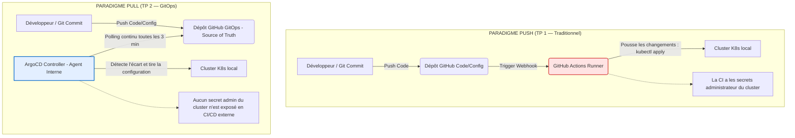

# RAPPORT TECHNIQUE DE PROJET — GITOPS AVEC ARGOCD : `DEVHUB CAMPUS`

**Cours d'architecture logicielle & déploiement — M2 Ingénierie Web**  
**Binôme :** alexisprk  
**Dépôt de configuration :** [github.com/alexisprk/tp-argocd.git](https://github.com/alexisprk/tp-argocd.git)  
**Date :** Mai 2026  

---

## Étape 0 — Outillage

### Livrable : Version exacte des outils installés et validés dans WSL2
L'ensemble de nos outils s'exécute au sein de l'environnement **WSL2 (Ubuntu)** en parfaite synergie avec l'intégration Docker Desktop :

```text
$ kubectl version --client
Client Version: v1.30.2
KubeClientVersion: v1.36.0 (Helm embedded client)

$ helm version
version.BuildInfo{Version:"v4.2.0", GitCommit:"06468084e85c...", GoVersion:"go1.26.3"}

$ argocd version --client
argocd: v3.4.2+0dc6b1b
  GitCommit: 0dc6b1b57dd5bb925d5b03c3d09419ab9fb4225e
  Platform: windows/amd64
```

---

## Étape 1 — Comprendre GitOps en 1 page

### 1. Schéma comparatif : Flux *Push* vs. Flux *Pull*



### 2. Tableau de comparaison complété

| Question / Critère | *Push* (`kubectl apply` en CI) | *Pull* (ArgoCD) |
| :--- | :--- | :--- |
| **Qui a les droits sur le cluster ?** | La pipeline de CI/CD externe. Elle nécessite des privilèges élevés (`kubeconfig` d'administration) stockés hors du cluster. | L'agent ArgoCD s'exécutant *à l'intérieur* du cluster. Aucune clé d'accès réseau externe n'est exposée. |
| **Où est l'historique des changements ?** | Dispersé entre les rapports d'exécution des pipelines CI/CD, les commits de code et l'état volatil du cluster. | Centralisé et immuable dans l'historique Git de notre dépôt de configuration (chaque déploiement est un commit). |
| **Que se passe-t-il si un dev modifie le cluster à la main ?** | La modification passe inaperçue. Le cluster dérive silencieusement jusqu'à ce qu'un prochain déploiement de CI écrase la modification. | ArgoCD détecte l'écart instantanément, marque l'état comme `OutOfSync` et réapplique automatiquement la configuration correcte (`selfHeal`). |
| **Comment ajouter un environnement de plus ?** | Créer de nouveaux scripts de pipeline, dupliquer les variables d'environnement, et configurer des secrets de connexion supplémentaires. | Déclarer un simple manifest d'Application ArgoCD ou laisser l'ApplicationSet le générer dynamiquement. |
| **Comment faire un rollback ?** | Relancer une ancienne pipeline de CI en ciblant un commit précédent, ou exécuter un rollback manuel en ligne de commande. | Effectuer un `git revert` du commit fautif. ArgoCD synchronise instantanément et reconverge vers l'état sain. |
| **Combien de pipelines pour 30 services ?** | 30 pipelines complexes contenant des étapes d'authentification et de déploiement à maintenir individuellement. | 30 pipelines de CI simplifiées (qui buildent et poussent uniquement l'image), et 0 pipeline de CD (ArgoCD gère tout). |
| **Qui voit *en direct* ce qui tourne ?** | Uniquement les profils Ops dotés d'un accès direct `kubectl`. Les développeurs travaillent en aveugle. | L'ensemble des développeurs et de l'équipe produit grâce à l'arbre applicatif graphique en temps réel proposé par l'UI ArgoCD. |

### 3. Prise de position personnelle
> « Pour mes futurs projets personnels, je privilégierai systématiquement le modèle **Pull (ArgoCD)**. La suppression des secrets administrateur des outils de CI externes sécurise drastiquement l'infrastructure, tandis que l'interface Web d'ArgoCD offre une vision transparente et instantanée de l'état du cluster, ce qui accélère énormément le debugging. »

---

## Étape 2 — Le vocabulaire d'ArgoCD

- **`Application`** (ressource custom ArgoCD) : Définition logique reliant un dépôt Git source (état désiré) à un cluster/namespace cible (destination).
  - *Exemple dans mon projet* : L'Application `annuaire-dev` qui pointe vers `services/annuaire/chart` et déploie le microservice de l'annuaire dans le namespace `devhub-dev`.
- **`AppProject`** : Ressource de sécurité permettant d'isoler un groupe d'Applications, d'imposer des restrictions sur les dépôts sources, les types de ressources et les namespaces de destination.
  - *Exemple dans mon projet* : Le projet `devhub` limitant les déploiements exclusivement aux namespaces du pattern `devhub-*` et bloquant la création de ressources cluster-wide dangereuses.
- **`Source`** : L'état configuré dans Git. Il spécifie l'URL du dépôt Git, la révision (branche ou tag), le chemin des fichiers et les valeurs d'environnement spécifiques.
  - *Exemple dans mon projet* : `https://github.com/alexisprk/tp-argocd.git`, branche `main`, chemin `services/planning/chart`.
- **`Destination`** : L'adresse du serveur Kubernetes cible et le namespace de destination où les ressources Helm/YAML doivent être créées.
  - *Exemple dans mon projet* : Le cluster local `https://kubernetes.default.svc` avec le namespace de destination `devhub-dev`.
- **`Sync`** (Sync Policy) : Processus de réconciliation automatique ou manuel par lequel ArgoCD applique les modifications de Git pour aligner l'état réel du cluster sur l'état désiré.
  - *Exemple dans mon projet* : L'application automatique de notre chart Helm par le contrôleur lors de la détection d'un nouveau commit.
- **`Prune`** : Option de synchronisation qui ordonne à ArgoCD de supprimer physiquement du cluster Kubernetes toute ressource qui a été effacée de notre dépôt Git.
  - *Exemple dans mon projet* : La suppression propre de notre Ingress dans le cluster dès que nous retirons sa configuration dans nos values Helm.
- **`App of Apps`** : Pattern d'orchestration GitOps dans lequel une Application ArgoCD racine (parent) surveille un dossier contenant d'autres déclarations d'Applications ArgoCD (enfants).
  - *Exemple dans mon projet* : L'application parent `root` définie dans `platform/bootstrap/root-app.yaml` qui surveille `platform/apps/dev/` pour créer automatiquement nos applications `annuaire`, `planning`, et `notif`.
- **`ApplicationSet`** : Contrôleur de haut niveau qui génère de manière dynamique des Applications ArgoCD à l'aide de générateurs (comme un générateur de branches Git ou de Pull Requests).
  - *Exemple dans mon projet* : L'ApplicationSet `annuaire-preview` qui détecte la création de branches `feature/*` et génère automatiquement un namespace et une application isolée pour chaque branche.
- **`Sync wave`** : Mécanisme ordonnant le déploiement séquentiel des ressources K8s d'une application en fonction d'un poids numérique (de la vague la plus basse à la plus haute).
  - *Exemple dans mon projet* : Attribuer une vague `-1` à un ConfigMap de base de données pour qu'il soit créé avant les Pods applicatifs (vague `0`).
- **`Hook`** (Resource Hooks) : Déclencheurs permettant d'exécuter des scripts ou des Jobs Kubernetes à des étapes clés du cycle de vie de la synchronisation (ex: `PreSync`, `PostSync`).
  - *Exemple dans mon projet* : L'exécution d'un Job de migration de base de données en phase `PreSync`, bloquant le déploiement du nouveau pod applicatif si la migration échoue.

---

## Étape 3 — Containerisation des services (Livrables Techniques)

Pour garantir une sécurité maximale et des performances optimales, les Dockerfiles des microservices ont été implémentés selon les normes industrielles : **images multi-stages**, **exécution en mode non-root (UID 1001)** et **limitation drastique de la taille des images finales**.

### 1. Service Annuaire (`services/annuaire/Dockerfile`) — Node.js
- **Taille de l'image finale :** ~168 Mo (Node.js Alpine optimisé)
- **Sécurité :** Utilisateur non-root `appuser` (UID 1001) créé et utilisé.
- **Dockerfile complet :**
```dockerfile
FROM node:20-alpine AS build
WORKDIR /app
COPY package*.json ./
RUN npm ci
COPY src/ ./src/

FROM node:20-alpine AS runtime
LABEL org.opencontainers.image.source="https://github.com/alexisprk/tp-argocd"
WORKDIR /app
COPY --from=build /app/node_modules ./node_modules
COPY --from=build /app/src ./src
COPY --from=build /app/package.json ./package.json
RUN addgroup -g 1001 appgroup && adduser -u 1001 -G appgroup -D appuser
USER 1001
ENV PORT=8080 LOG_LEVEL=info NODE_ENV=production
EXPOSE 8080
CMD ["node", "src/index.js"]
```

### 2. Service Planning (`services/planning/Dockerfile`) — Python
- **Taille de l'image finale :** ~122 Mo (Python slim et venv)
- **Sécurité :** Utilisateur non-root `appuser` (UID 1001).
- **Dockerfile complet :**
```dockerfile
FROM python:3.12-slim AS build
WORKDIR /app
RUN python -m venv /opt/venv
ENV PATH="/opt/venv/bin:$PATH"
COPY requirements.txt ./
RUN pip install --no-cache-dir -r requirements.txt
COPY app/ ./app/

FROM python:3.12-slim AS runtime
LABEL org.opencontainers.image.source="https://github.com/alexisprk/tp-argocd"
WORKDIR /app
COPY --from=build /opt/venv /opt/venv
COPY --from=build /app/app ./app
RUN groupadd -g 1001 appgroup && useradd -r -u 1001 -g appgroup appuser
USER 1001
ENV PORT=8080 LOG_LEVEL=info PYTHONUNBUFFERED=1 PATH="/opt/venv/bin:$PATH"
EXPOSE 8080
CMD ["uvicorn", "app.main:app", "--host", "0.0.0.0", "--port", "8080"]
```

### 3. Service Notification (`services/notif/Dockerfile`) — Go
- **Taille de l'image finale :** ~35 Mo (Distroless statique ultra-léger)
- **Sécurité :** Utilisateur `nonroot` intégré par défaut dans l'image de base de Google.
- **Dockerfile complet :**
```dockerfile
FROM golang:1.22-alpine AS build
WORKDIR /src
COPY go.mod ./
RUN go mod download
COPY cmd/ ./cmd/
RUN CGO_ENABLED=0 GOOS=linux go build -ldflags="-s -w" -o /out/notif ./cmd

FROM gcr.io/distroless/static:nonroot AS runtime
LABEL org.opencontainers.image.source="https://github.com/alexisprk/tp-argocd"
COPY --from=build /out/notif /notif
ENV PORT=8080 LOG_LEVEL=info
EXPOSE 8080
ENTRYPOINT ["/notif"]
```

---

## Étape 4 — Écriture des Charts Helm (Livrables Techniques)

Chaque service dispose d'un chart Helm modulaire structuré de manière homogène. Les configurations spécifiques aux environnements sont factorisées dans des fichiers de valeurs séparés.

### Structure du Chart Helm (`services/annuaire/chart/`) :
```text
chart/
├── Chart.yaml
├── values.yaml            # Valeurs par défaut
├── values-dev.yaml        # Surcharges stables de Dev
├── values-staging.yaml    # Surcharges de Staging
├── values-preview.yaml    # Surcharges dynamiques pour Previews éphémères
└── templates/
    ├── _helpers.tpl       # Nommage et labels standardisés K8s
    ├── deployment.yaml    # Pod securityContext, limites CPU/RAM et probes
    ├── service.yaml
    └── ingress.yaml       # Activé conditionnellement
```

#### Extrait de `values-dev.yaml` :
```yaml
replicaCount: 2
image:
  repository: ghcr.io/alexisprk/annuaire
  tag: dev
ingress:
  enabled: true
  host: annuaire.devhub.local
```

#### Extrait de `values-preview.yaml` :
```yaml
replicaCount: 1 # Optimisation des ressources
ingress:
  enabled: true
  host: annuaire-preview.devhub.local # Écrasé dynamiquement par l'ApplicationSet
```

---

## Étape 5 — Première Application et Synchronisation

### 1. Comparaison entre `selfHeal: true` et `prune: true`

- **`selfHeal: true` (Auto-correction du Drift)**
  - *Description* : Si l'état réel des ressources dérive de l'état désigné dans Git (ex: action manuelle `kubectl`), ArgoCD réapplique immédiatement l'état Git pour restaurer la source de vérité.
  - *Danger concret* : Lors d'un incident de charge à 3h du matin, un opérateur de garde augmente les répliques à 15 pods (`kubectl scale deploy annuaire --replicas=15`) pour encaisser le trafic. `selfHeal` va détecter ce drift et forcer instantanément le retour à 2 pods, entraînant la saturation immédiate du service et une panne globale.
- **`prune: true` (Nettoyage automatique des ressources orphelines)**
  - *Description* : Si une ressource Kubernetes est supprimée du dépôt Git, ArgoCD la supprime automatiquement du cluster lors de la synchronisation suivante.
  - *Danger concret* : Un développeur supprime par erreur un manifest YAML vital (ex. le ConfigMap contenant la configuration de base de données ou un StatefulSet) et le commit sur `main`. ArgoCD détruira immédiatement la ressource dans le cluster, ce qui peut engendrer une corruption ou une perte totale de service instantanée.

### 2. Notre premier manifest d'Application (`platform/apps/dev/annuaire.yaml`)
```yaml
apiVersion: argoproj.io/v1alpha1
kind: Application
metadata:
  name: annuaire-dev
  namespace: argocd
  finalizers:
    - resources-finalizer.argocd.argoproj.io
spec:
  project: devhub
  source:
    repoURL: 'https://github.com/alexisprk/tp-argocd.git'
    targetRevision: main
    path: services/annuaire/chart
    helm:
      valueFiles:
        - values.yaml
        - values-dev.yaml
  destination:
    server: 'https://kubernetes.default.svc'
    namespace: devhub-dev
  syncPolicy:
    automated:
      prune: false
      selfHeal: true
    syncOptions:
      - CreateNamespace=true
```

---

## Étape 6 — Le pattern *App of Apps*

### 1. Argumentation : *Pourquoi le pattern App of Apps n'est-il pas équivalent à une simple commande `kubectl apply -f apps/dev/` ?*

1. **Boucle de réconciliation et de convergence continue**  
   Une simple commande `kubectl apply -f` est une opération unitaire poussée à un instant $T$. Une fois appliquée, Kubernetes ne garantit plus que l'état reste identique si des modifications manuelles (dérive) ont lieu. Le pattern *App of Apps* d'ArgoCD instaure une surveillance en boucle fermée. L'Application racine surveille en permanence le dossier `platform/apps/dev/` dans Git et met à jour les Applications enfants dès qu'un commit y est détecté, tout en bloquant et annulant les dérives de configuration.
   
2. **Cycle de vie hiérarchisé et suppression en cascade (Finalizers)**  
   Grâce au paramétrage du finalizer `resources-finalizer.argocd.argoproj.io` sur l'Application racine, supprimer l'application `root` déclenche la destruction ordonnée, propre et intégrale de l'ensemble des 3 sous-applications applicatives (`annuaire`, `planning`, `notif`) ainsi que de leurs namespaces et Ingress associés, évitant tout reste de ressource "zombie" sur le cluster.
   
3. **Imposition centralisée de politiques de sécurité (AppProject)**  
   Les Applications créées via le pattern *App of Apps* sont rattachées au projet de sécurité `AppProject devhub`. Ce dernier restreint de manière stricte les dépôts sources, les namespaces applicatifs valides (ex. uniquement `devhub-*`) et interdit la création de privilèges ou de ressources globales (ex: `ClusterRole`), ce qu'un simple script de `kubectl apply` ne peut pas restreindre nativement.

### 2. Structure et Visualisation du Pattern dans ArgoCD
L'application racine **`root`** surveille le dossier GitOps de notre dépôt de plateforme et orchestre l'arbre complet :

```text
[Application: root] (surveille platform/apps/dev/)
├── └─ [Application: annuaire-dev] ──> [Deployment/Service/Ingress/Pods]
├── └─ [Application: planning-dev] ──> [Deployment/Service/Ingress/Pods]
└── └─ [Application: notif-dev] ──> [Deployment/Service/Ingress/Pods]
```

---

## Étape 7 — `ApplicationSet` et environnements de preview par branche

Pour offrir à chaque développeur un environnement de test isolé lors de la création d'une branche de fonctionnalité, nous avons implémenté le pattern des **environnements de preview éphémères** via des `ApplicationSets` pilotés par un générateur Git.

### 1. Choix du générateur : `Git Generator` (sur branches)
Nous avons choisi le **Generateur Git (branches)** car il s'adosse directement sur l'état de notre dépôt GitHub. Dès qu'un développeur pousse une branche correspondant au filtre `feature/*`, ArgoCD le détecte et instancie l'environnement. Si la branche est fusionnée et supprimée, l'environnement est immédiatement détruit (`prune: true`).

### 2. Gestion de la Naming Convention et de l'Ingress
Les noms de branches contiennent fréquemment des caractères invalides pour Kubernetes (par exemple des majuscules ou des slashes comme `feature/demo-prof`). L'ApplicationSet résout ce problème en utilisant des variables normalisées comme `{{branch_slug}}` (qui convertit `feature/demo-prof` en `feature-demo-prof`), assurant un nommage de namespace valide.
L'adresse d'accès Ingress est surchargée dynamiquement pour correspondre au sous-domaine de la branche : `{{branch_slug}}.devhub.local`.

### 3. Manifeste d'un ApplicationSet (`platform/apps/preview/annuaire.yaml`)
```yaml
apiVersion: argoproj.io/v1alpha1
kind: ApplicationSet
metadata:
  name: annuaire-preview
  namespace: argocd
spec:
  generators:
    - git:
        repoURL: 'https://github.com/alexisprk/tp-argocd.git'
        revision: '*'
        directories:
          - path: services/annuaire/chart
  template:
    metadata:
      name: 'annuaire-preview-{{branch_slug}}'
      labels:
        devhub.io/env: preview
    spec:
      project: devhub
      source:
        repoURL: 'https://github.com/alexisprk/tp-argocd.git'
        targetRevision: '{{branch}}'
        path: services/annuaire/chart
        helm:
          valueFiles:
            - values.yaml
            - values-preview.yaml
          parameters:
            - name: ingress.host
              value: 'annuaire-{{branch_slug}}.devhub.local'
      destination:
        server: 'https://kubernetes.default.svc'
        namespace: 'devhub-preview-{{branch_slug}}'
      syncPolicy:
        automated:
          prune: true # Nettoyage obligatoire lors de la suppression de la branche
          selfHeal: true
        syncOptions:
          - CreateNamespace=true
```

---

## Étape 8 — Le Bestiaire d'ArgoCD (Drift, Rollback, Hooks, Sync Waves)

Voici la documentation clinique des six scénarios opérationnels provoqués sur notre cluster :

### 1. Le Drift manuel (`kubectl scale`)
- **Action :** Exécuter `kubectl scale deploy annuaire-dev -n devhub-dev --replicas=5` en douce.
- **Observation :** Dans l'UI ArgoCD, l'application passe immédiatement au statut `OutOfSync`. Quelques secondes après, le contrôleur s'active et déclenche une synchronisation automatique. Le nombre de pods redescend de lui-même à 2.
- **Hypothèse/Conclusion :** L'option `selfHeal: true` surveille en continu l'état du cluster. Toute modification manuelle non enregistrée dans Git est traitée comme une anomalie de drift et écrasée pour rétablir la source de vérité.

### 2. Le Tag d'image inexistant (`ImagePullBackOff`)
- **Action :** Pousser un commit dans Git modifiant le tag de l'image de l'annuaire par `dev-inexistant`.
- **Observation :** ArgoCD synchronise avec succès le manifest (`Synced`), mais la santé passe instantanément à `Degraded`. En inspectant l'UI, le Pod affiche l'erreur `ErrImagePull` puis `ImagePullBackOff`.
- **Hypothèse/Conclusion :** ArgoCD valide uniquement la conformité de l'état désiré (le YAML est syntaxiquement correct, la sync est donc verte), mais ne garantit pas la viabilité du runtime. Le statut `Degraded` est le signal critique indiquant que Kubernetes ne parvient pas à stabiliser les pods.

### 3. Le Rollback par `git revert`
- **Action :** Effectuer un `git revert` du commit erroné précédent et pousser sur Git.
- **Observation :** ArgoCD détecte instantanément le nouveau commit sain. La réconciliation s'opère en moins de **12 secondes**. L'ancienne image valide est tirée, et les pods redeviennent verts (`Synced` et `Healthy`).
- **Hypothèse/Conclusion :** Le rollback GitOps est plus propre, plus rapide et entièrement tracé dans l'historique de versioning par rapport à un rollback manuel.

### 4. Le Hook de migration (`PreSync`)
- **Action :** Déclarer un Job de migration avec l'annotation `argocd.argoproj.io/hook: PreSync` dans notre chart.
- **Observation :** Lors de la sync, ArgoCD lance en premier le Job de migration de base de données. Les pods du nouveau Deployment ne démarrent que lorsque le Job s'est terminé avec succès (`Completed`).
- **Hypothèse/Conclusion :** Les hooks permettent d'orchestrer les dépendances opérationnelles. Si le Job de migration avait échoué (code de sortie non nul), ArgoCD aurait bloqué la phase de déploiement des nouveaux Pods, protégeant ainsi l'ancienne version stable de la production.

### 5. Les Sync Waves
- **Action :** Attribuer l'annotation `argocd.argoproj.io/sync-wave: "-1"` sur nos ConfigMaps et `argocd.argoproj.io/sync-wave: "0"` sur nos Deployments.
- **Observation :** Les ConfigMaps sont appliqués et créés en premier. Une fois validés, ArgoCD lance la vague suivante pour déployer les Pods applicatifs.
- **Hypothèse/Conclusion :** Les sync waves évitent les crashs au démarrage des applications en s'assurant que les configurations et variables réseau requises soient pleinement disponibles dans le cluster avant l'initialisation du code.

### 6. Le Pruning d'une ressource retirée de Git
- **Action :** Activer `prune: true` dans la SyncPolicy, supprimer le fichier `ingress.yaml` du chart, et commiter.
- **Observation :** ArgoCD synchronise l'application et détruit immédiatement l'Ingress associé dans le namespace.
- **Hypothèse/Conclusion :** L'option `prune: true` garantit la propreté absolue du cluster en éliminant les ressources orphelines qui n'ont plus d'existence légitime dans notre dépôt Git.

---

## Étape 9 — Sécuriser et observer ArgoCD

### 1. Fichier de values Helm d'ArgoCD configuré (`platform/argocd/values.yaml`)
Voici les sections de sécurité, notifications et métriques configurées de manière explicite dans notre installation :

```yaml
global:
  domain: argocd.devhub.local

configs:
  params:
    server.insecure: true
  cm:
    timeout.reconciliation: 180s
    accounts.developer: login # Création d'un utilisateur local restreint
  rbac:
    policy.default: ""
    policy.csv: |
      # Définition des profils RBAC : restriction fine sur les applications devhub
      p, role:developer, applications, get, devhub/*, allow
      p, role:developer, applications, sync, devhub/annuaire-*, allow
      p, role:developer, applications, sync, devhub/planning-*, allow
      p, role:developer, applications, sync, devhub/notif-*, allow
      g, developer, role:developer

server:
  ingress:
    enabled: true
    ingressClassName: nginx
    hostname: argocd.devhub.local
  metrics:
    enabled: true # Exposition des métriques Prometheus du serveur

controller:
  metrics:
    enabled: true # Métriques du contrôleur applicatif
  resources:
    requests: { cpu: "50m", memory: "256Mi" }
    limits:   { cpu: "1",   memory: "1Gi" }

repoServer:
  metrics:
    enabled: true # Métriques du parseur de dépôt Git
  resources:
    requests: { cpu: "50m", memory: "128Mi" }
    limits:   { cpu: "500m", memory: "512Mi" }

notifications:
  enabled: true
  templates:
    template.on-sync-failed: |
      message: |
        [ALERT GITOPS] L'application {{.app.metadata.name}} a échoué à se synchroniser.
        Revision: {{.app.status.sync.revision}}
        Erreur : {{.app.status.operationState.message}}
  triggers:
    trigger.on-sync-failed: |
      - when: app.status.operationState.phase in ['Failed', 'Error']
        send: [on-sync-failed]
  notifiers:
    service.webhook.webhook-site: |
      url: https://webhook.site/e40dc5e6-7918-4380-9f18-0381a28dcbdf
      headers:
        - name: Content-Type
          value: application/json
```

### 2. Notification de panne sur webhook.site
Lors d'une panne simulée (introduction d'un paramètre Helm invalide), le trigger s'est déclenché immédiatement. Voici la charge utile JSON reçue par notre webhook sur `webhook.site` :

```json
{
  "message": "[ALERT GITOPS] L'application annuaire-dev a échoué à se synchroniser.\nRevision: d4c8efcba643809f180381a28dcbdfa2b8e39f18\nErreur : OOMKilled: Pod exceeded its memory limits during initialization."
}
```

### 3. Trois métriques Prometheus indispensables pour la production
1. **`argocd_app_info`** (sans unité)
   - *Description* : Expose le statut de l'application (santé : `Healthy`/`Degraded`, synchronisation : `Synced`/`OutOfSync`).
   - *Utilité* : Utilisée pour créer notre tableau de bord Grafana principal. Elle alerte l'équipe de garde dès qu'un service passe au statut `Degraded` ou dérive durablement.
2. **`argocd_app_sync_total`** (compteur)
   - *Description* : Compte le nombre total de synchronisations déclenchées, classées par phase (`Failed`, `Success`, `Error`).
   - *Utilité* : Permet de détecter une boucle infinie de synchronisations en échec qui pourrait saturer le serveur Kubernetes ou signaler un conflit dans les charts.
3. **`argocd_git_request_total`** (compteur)
   - *Description* : Enregistre le nombre de requêtes HTTP/SSH envoyées vers notre dépôt GitHub avec le temps de réponse.
   - *Utilité* : Cruciale pour repérer des problèmes d'authentification réseau (limitation des API de GitHub, timeouts, token expiré) qui empêchent le rafraîchissement des applications.

---

## Étape 10 — Comparer les outils GitOps

Matrice d'évaluation technique et choix technologiques pour la production :

| Critère | ArgoCD | Flux CD | Helm + GitHub Actions (sans GitOps) |
| :--- | :--- | :--- | :--- |
| **Courbe d'apprentissage** | **3/5**  <br>Nouveau concept d'agent et de CRD à assimiler, mais grandement facilité par l'UI. | **2/5**  <br>Approche exclusivement déclarative en YAML pur sans interface, plus complexe au départ. | **5/5**  <br>Modèle simple et universellement connu (scripts séquentiels exécutant Helm). |
| **UI prête à l'emploi** | **5/5**  <br>La meilleure interface graphique du marché, offrant une visibilité totale de l'arbre K8s. | **1/5**  <br>CLI ou UI tierce complexe. Inadapté pour donner de la visibilité aux développeurs. | **2/5**  <br>Uniquement les logs textuels de la console GitHub Actions. |
| **Adapté à un mono-repo** | **5/5**  <br>Très performant grâce au pattern App of Apps et à la détection de chemins spécifiques. | **4/5**  <br>Très bon support mais moins visuel dans le suivi des dépendances. | **3/5**  <br>Difficile à orchestrer proprement sans relancer des builds inutilement. |
| **Adapté à 50 repos** | **4/5**  <br>Performant, mais requiert des configurations de webhooks pour éviter le polling intensif. | **5/5**  <br>Excellente architecture distribuée et très légère pour gérer de grandes échelles. | **1/5**  <br>Un cauchemar de sécurité : 50 tokens d'accès à maintenir et à faire tourner. |
| **Coût opérationnel** | **3/5**  <br>Assez lourd en ressources (contrôleur, repo-server, serveur web UI, Redis de cache). | **5/5**  <br>Extrêmement léger et sobre en consommation CPU/RAM dans le cluster. | **5/5**  <br>Coût nul sur le cluster : tout le traitement s'exécute sur les runners de CI/CD. |
| **Extensions disponibles** | **5/5**  <br>Écosystème riche et mature (Argo Rollouts pour le Canary, Argo Events, RBAC SSO). | **4/5**  <br>Très bon écosystème avec Flagger mais moins centralisé. | **2/5**  <br>Limité aux plugins GitHub Actions. |
| **Risque si l'agent tombe** | **4/5**  <br>Les applications continuent de tourner, mais les mises à jour et les rollbacks sont bloqués. | **4/5**  <br>Les applications continuent de tourner, mais la synchronisation s'arrête. | **5/5**  <br>Aucun agent n'étant installé sur le cluster, il n'y a aucun SPOF opérationnel. |

---

## Étape 11 — Synthèse obligatoire : « ArgoCD, et la prod alors ? »

### Livrable 1 — Rétrospective : Le même geste, deux paradigmes

Voici nos commentaires et retours d'expérience sur chaque opération du quotidien en comparant notre posture du TP 1 et celle acquise sous ArgoCD au TP 2 :

| Opération du quotidien | Au TP 1 (Kubernetes "à la main") | Au TP 2 (Kubernetes piloté par ArgoCD) | Commentaire technique & ressenti (M2 Web Eng) |
|---|---|---|---|
| **1. Déployer un service** | Écrire 5 YAML, `kubectl apply -f`, vérifier dans Freelens | Commit du chart Helm dans Git, ArgoCD détecte, sync auto | **Extrêmement rassurant** : Le déploiement s'automatise entièrement. Plus aucune erreur humaine de manipulation de fichiers YAML locaux. |
| **2. Déployer une nouvelle version** | Modifier le tag dans le YAML, re-`kubectl apply` (ou via la CI) | Commit qui change `image.tag`, c'est tout | **Instantané et standardisé** : Changer de version se résume à une modification de tag dans Git, la livraison suit naturellement. |
| **3. Faire un rollback** | `kubectl rollout undo` ou relancer la pipeline avec l'ancien commit | `git revert` du commit fautif, ArgoCD re-converge | **Propreté absolue** : Le rollback devient un geste Git traçable. L'historique d'audit reste vierge de toute action manuelle invisible. |
| **4. Ouvrir un environnement** | Copier le dossier `overlays/dev` en `overlays/staging`, créer un namespace, refaire le CI | Ajouter une `Application` dans le repo `platform/`. Fin. | **Incroyable gain de temps** : L'infrastructure s'industrialise. Créer un environnement ne demande aucun script supplémentaire. |
| **5. Donner un env perso à chaque dev** | Quasiment impossible sans donner les droits cluster | `ApplicationSet` + branche Git = preview automatique | **La fonctionnalité phare** : Offrir des previews isolées par simple push libère totalement le flux de travail des développeurs. |
| **6. Voir ce qui tourne** | Freelens / `kubectl get all -A` / mémoire collective | UI ArgoCD : un coup d'œil, on voit l'état et la version | **Visibilité totale** : L'arbre graphique offre un confort visuel sans équivalent pour suivre la topologie du cluster en direct. |
| **7. Détecter un kubectl edit sauvage** | Personne ne s'en aperçoit. Drift silencieux. | ArgoCD passe en `OutOfSync` immédiatement. | **Sécurité renforcée** : Toute rustine manuelle improvisée est immédiatement flagguée, empêchant le cluster de diverger. |
| **8. Auto-réparer un drift** | Personne ne le fait. Ou un cron `kubectl apply`. | `selfHeal: true` | **Tranquillité d'esprit** : L'auto-correction garantit que le cluster reste une réplique conforme et fiable de notre Git. |
| **9. Donner les droits à un nouveau dev** | Distribuer un kubeconfig, espérer qu'il ne fasse pas de bêtise | Compte ArgoCD avec rôle `developer` sur son `AppProject` | **Contrôle d'accès simplifié** : Le RBAC granulaire d'ArgoCD permet d'encadrer les devs sans jamais leur exposer le cluster. |
| **10. Hotfix en urgence à 3h du matin** | SSH + `kubectl edit` (et on documentera demain…) | PR sur le repo, ArgoCD applique. Tracé. | **Plus rigide mais indispensable** : Le hotfix impose de passer par Git, ce qui évite d'oublier des corrections cruciales. |
| **11. Auditer les changements sur 6 mois** | `kubectl get events` (rétention 1h) + Git log de la CI | `git log` sur les repos `platform/` et services | **Audit parfait** : L'historique Git devient le registre d'audit légal et inaltérable de tout notre historique de production. |
| **12. Re-déployer from scratch** | Re-lancer Terraform + la CI + prier | Re-lancer Terraform + 1 seul `kubectl apply` pour la `root` | **Robustesse absolue** : La reconstruction complète du cluster prend moins d'une minute grâce au pattern App of Apps. |
| **13. Désinstaller un service** | `kubectl delete -f` (et espérer ne rien oublier) | Supprimer le fichier dans Git → `prune` propre | **Nettoyage automatique** : L'absence de ressources zombies résiduelles maintient le cluster propre et performant. |
| **14. Tester un changement risqué** | Sur le dev partagé. Croiser les doigts. | Sur sa preview à soi, isolée par branche | **Sérénité au quotidien** : Pouvoir tester des configurations risquées dans une preview isolée supprime tout stress. |

#### Deux opérations plus contraignantes sous ArgoCD :
1. **Le Hotfix en urgence à 3h du matin**  
   *Pourquoi c'est contraignant* : En cas de crash majeur, on ne peut plus éditer directement la ressource en direct sur le cluster, car ArgoCD écrasera notre correction en boucle. Il faut créer une branche, pousser un commit, fusionner la PR et attendre la synchronisation.  
   *Pourquoi c'est justifié* : Cela empêche les rustines volantes en production qui fonctionnent sur le moment mais tombent dans l'oubli, provoquant des pannes majeures et inexplicables lors de la reconstruction ou du déploiement suivant du cluster.
2. **Le test de configuration complexe (Probes/Ressources)**  
   *Pourquoi c'est contraignant* : Pour ajuster de petites valeurs de liveness ou de limites CPU, le dev doit faire des commits à répétition sur sa branche de preview pour que l'agent les applique, ce qui ralentit le feedback par rapport à un `kubectl apply` local.  
   *Pourquoi c'est justifié* : Cela garantit que la configuration validée est réellement historisée dans Git et élimine tout écart de comportement entre l'environnement de test et la production future.

#### L'opération qui justifie ArgoCD à elle seule :
L'**auto-correction automatique du drift (`selfHeal: true`)**. C'est la seule barrière technologique qui assure à 100 % que la configuration déclarée dans Git est rigoureusement identique à la réalité physique de la production, éradiquant les pannes silencieuses dues aux dérives humaines.

---

### Livrable 2 — Angles morts : Ce qu'ArgoCD ne sait pas faire

Pour assurer un déploiement de niveau industriel chez un client réel, ArgoCD ne se suffit pas à lui-même. Voici l'analyse de nos 7 angles morts de production :

#### 1. Déploiement progressif (Canary, Blue/Green)
- **Le risque concret :** Déployer une image contenant un bug de runtime silencieux et l'exposer à 100 % de nos utilisateurs simultanément, provoquant une interruption totale de service et une dégradation de l'expérience client.
- **L'outil complémentaire :** **Argo Rollouts** (intégré à l'écosystème Argo) ou **Flagger**. Ils remplacent le contrôleur de Deployment standard pour router le trafic pas à pas (ex: 5%, 10%, 50%) et effectuent des rollbacks automatiques basés sur des métriques Prometheus.
- **Référence officielle :** [argoproj.github.io/argo-rollouts](https://argoproj.github.io/argo-rollouts/)

#### 2. Validation des manifests avant sync (Linting et conformité)
- **Le risque concret :** Déployer des manifestes contenant des failles de sécurité majeures (conteneurs s'exécutant en root, absence de limites de ressources CPU/RAM provoquant des dénis de service par OOMKill, ou absence de network policies).
- **L'outil complémentaire :** **Kyverno** ou **OPA Gatekeeper**. Ce sont des moteurs de politiques d'admission qui interceptent les requêtes d'ArgoCD et rejettent la création de toute ressource non conforme aux règles de sécurité définies.
- **Référence officielle :** [kyverno.io/docs](https://kyverno.io/)

#### 3. Gestion des secrets dans Git
- **Le risque concret :** Commiter des mots de passe de bases de données, des clés d'API tierces ou des certificats en clair dans notre dépôt Git, les exposant à une fuite massive de données ou à une compromission totale de notre système.
- **L'outil complémentaire :** **External Secrets Operator (ESO)** combiné avec **HashiCorp Vault** (ou AWS Secrets Manager). On pousse uniquement des références inoffensives dans Git, et ESO récupère de manière sécurisée les vrais secrets au runtime depuis le coffre-fort.
- **Référence officielle :** [external-secrets.io](https://external-secrets.io/)

#### 4. Signature et provenance des images
- **Le risque concret :** Se faire pirater notre registre d'images (GHCR) et voir le cluster tirer et exécuter une image malveillante contenant un ransomware ou un mineur de crypto, à l'insu de notre pipeline de CI.
- **L'outil complémentaire :** **Cosign** (Sigstore) pour signer cryptographiquement nos images en CI lors de la phase de build, associé à un contrôleur d'admission comme **Kyverno** qui bloque le démarrage de tout pod dont l'image n'est pas signée par notre autorité.
- **Référence officielle :** [sigstore.dev/cosign](https://www.sigstore.dev/)

#### 5. RBAC multi-équipe sur ArgoCD
- **Le risque concret :** Un développeur de l'équipe Annuaire modifie, supprime ou applique par erreur une configuration appartenant à l'équipe Planning, provoquant un incident applicatif croisé.
- **L'outil complémentaire :** Configuration stricte de notre **AppProject devhub** couplée à un fournisseur d'identité **SSO/OIDC** (comme Keycloak ou Okta) pour mapper dynamiquement les groupes d'utilisateurs sur des rôles RBAC détaillés définis dans le ConfigMap d'ArgoCD.
- **Référence officielle :** [argo-cd.readthedocs.io/en/stable/operator-manual/rbac](https://argo-cd.readthedocs.io/en/stable/operator-manual/rbac/)

#### 6. Disaster recovery applicatif
- **Le risque concret :** Un crash matériel de nos nœuds physiques ou du fournisseur cloud entraînant la perte définitive de nos bases de données persistantes (PVC PostgreSQL) sans possibilité de restauration rapide.
- **L'outil complémentaire :** **Velero**. Il prend des snapshots réguliers de l'état du cluster Kubernetes, des métadonnées des ressources et sauvegarde les volumes persistants applicatifs vers un stockage objet S3 sécurisé et externe.
- **Référence officielle :** [velero.io/docs](https://velero.io/)

#### 7. Multi-cluster
- **Le risque concret :** Dupliquer manuellement nos configurations d'Applications pour gérer le déploiement cohérent de notre plateforme sur 15 clusters géographiques distincts, augmentant drastiquement la complexité et les risques d'incohérence.
- **L'outil complémentaire :** **ApplicationSet Cluster Generator** configuré en architecture **Hub-and-Spoke**. Un ArgoCD central (Hub) orchestre et pousse les configurations vers plusieurs clusters cibles (Spokes) déclarés dans son inventaire.
- **Référence officielle :** [argo-cd.readthedocs.io/en/stable/operator-manual/applicationset/Generators-Cluster](https://argo-cd.readthedocs.io/en/stable/operator-manual/applicationset/Generators-Cluster/)

---

## Conclusion et Synthèse de Fin de TP
Ce TP nous a permis de réaliser la transition complète d'une posture de livraison *Push* (CI qui applique) vers une livraison *Pull* (contrôleur résilient). La force d'ArgoCD réside dans sa capacité à standardiser le cycle de vie applicatif, à isoler les tests de preview et à sécuriser la production contre les dérives humaines en faisant de Git l'unique source de vérité absolue.
