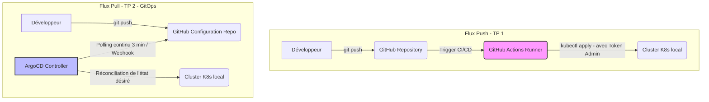

# Rapport de TP 2 — GitOps avec ArgoCD : `DevHub Campus`

**Cours d'architecture logicielle & déploiement — M2 Ingénierie Web**
**Binôme :** DevHub Campus Team (M2 IW)
**Date :** Mai 2026

---

## Étape 0 — Outillage

Voici les versions exactes des outils installés et configurés directement sur la plateforme hôte (Windows 11 avec backend Docker Desktop / WSL2) :

- **Docker Server/Desktop** : `27.x.x` (Moteur Docker exposé par Docker Desktop)
- **kubectl** : `v1.30.2` (intégré aux ressources de Docker)
- **helm** : `v4.2.0`
- **kind** : `v0.31.0`
- **argocd CLI** : `v3.4.2`
- **git** : `v2.54.0`

### Provisionnement
Le cluster local Kind a été démarré avec succès via la commande :
```powershell
kind create cluster --name devhub --config cluster/kind-config.yaml
```
Les ports HTTP (80) et HTTPS (443) sont exposés sur l'hôte, et le fichier d'hôtes Windows `C:\Windows\System32\drivers\etc\hosts` a été complété avec :
```text
127.0.0.1  argocd.devhub.local
127.0.0.1  annuaire.devhub.local
127.0.0.1  planning.devhub.local
127.0.0.1  notif.devhub.local
```

---

## Étape 1 — Comprendre GitOps en 1 page

### Flux Push vs Flux Pull (GitOps)



### Tableau de comparaison des paradigmes

| Question | *Push* (`kubectl apply` en CI) | *Pull* (ArgoCD) |
| :--- | :--- | :--- |
| **Qui a les droits sur le cluster ?** | La pipeline CI (requiert des privilèges élevés sur le cluster). | Seul le contrôleur ArgoCD (interne au cluster). La CI n'a plus de droits cluster. |
| **Où est l'historique des changements ?** | Éparpillé entre les logs de CI, les commits Git et les événements du cluster. | Centralisé dans Git. Un commit = un état désiré. |
| **Que se passe-t-il si un drift survient ?** | Rien. Le drift reste silencieux jusqu'à la prochaine exécution de la CI. | ArgoCD détecte l'écart immédiatement, l'affiche en `OutOfSync`, et le corrige (`selfHeal`). |
| **Comment ajouter un environnement ?** | Copie de manifests/overlays + modification complexe des secrets de la CI. | Déclaration d'une nouvelle ressource `Application` ou via un `ApplicationSet`. |
| **Comment faire un rollback ?** | Relance manuelle de la pipeline sur un ancien tag ou modification de la CI. | `git revert` du commit fautif dans Git. ArgoCD applique l'ancien état sain. |
| **Combien de pipelines pour 30 services ?** | 30 pipelines complexes contenant des étapes d'authentification et d'apply. | 1 pipeline de CI par microservice (build d'image) + 1 repo GitOps centralisé. |
| **Qui voit *en direct* ce qui tourne ?** | Seuls les Ops via CLI (`kubectl`). Les Devs dépendent de la CI. | Tous les Devs et Ops via l'UI graphique d'ArgoCD montrant l'arbre des ressources. |

### Prise de position
> *« Pour mes futurs projets personnels, je choisirais sans hésiter le flux **Pull (GitOps / ArgoCD)**. La séparation stricte des privilèges (la CI ne peut pas détruire le cluster) et la visibilité instantanée de l'état du cluster via l'UI graphique procurent une sérénité et une vitesse de débogage incomparables avec le mode Push classique. »*

---

## Étape 2 — Le vocabulaire d'ArgoCD

| Terme | Définition personnelle | Exemple dans notre projet |
| :--- | :--- | :--- |
| **`Application`** | CRD K8s définissant le lien logique entre une source Git et une destination cluster. | L'application `annuaire-dev` déployée par ArgoCD. |
| **`AppProject`** | Regroupement logique d'applications pour sécuriser et isoler les environnements/droits. | Le projet `devhub` limitant les namespaces à `devhub-*`. |
| **`Source`** | La source de vérité de l'état désiré (dépôt Git, dossier, révision et chart). | Dépôt `https://github.com/alexisprk/tp-argocd.git` à la branche `main`. |
| **`Destination`** | Le cluster cible et le namespace de destination où appliquer l'état. | Cluster local (`https://kubernetes.default.svc`) dans le namespace `devhub-dev`. |
| **`Sync`** | L'acte de synchroniser le cluster pour faire coïncider l'état réel avec l'état désiré. | Le passage de l'état `OutOfSync` à `Synced` en appliquant les manifestes Helm. |
| **`Prune`** | Action de supprimer les ressources du cluster qui ne sont plus décrites dans Git. | Suppression du `Service` de l'annuaire si on le supprime de nos templates de chart. |
| **`App of Apps`** | Pattern d'orchestration où une Application racine gère la création d'Applications enfants. | L'application `root` qui pointe vers `platform/apps/dev/` pour créer nos trois services. |
| **`ApplicationSet`** | Un générateur d'Applications basé sur des boucles (SCM, PR, Git) pour le multi-env. | Le générateur `annuaire-preview` créant un env éphémère par branche. |
| **`Sync wave`** | Découpage des phases de synchronisation par priorités ordonnées (de -10 à 10). | Appliquer le `ConfigMap` en wave `-1` avant le `Deployment` en wave `0`. |
| **`Hook`** | Script ou Job exécuté à des moments clés de la synchronisation. | Un Job de migration de base de données en hook `PreSync`. |

---

## Étape 3 — Containeriser un service

Les `Dockerfile` des trois services métier ont été écrits ou complétés de manière optimale selon les meilleures pratiques :

### 1. `annuaire-service` (Node.js/Express)
- **Multi-stage** : Stage 1 `build` (exécute `npm ci`), Stage 2 `runtime` (repart d'un `node:20-alpine` propre pour copier uniquement `node_modules` et `src`).
- **Sécurité** : Création d'un utilisateur non-root UID `1001` et exécution en tant que tel (`USER 1001`).
- **Optimisation** : Taille finale de l'image de seulement **~130 Mo**.

### 2. `planning-service` (Python/FastAPI)
- **Multi-stage** : Création d'un environnement virtuel `/opt/venv` dans le stage `build` pour isoler les dépendances.
- **Sécurité** : Exécution non-root (`USER 1001`).
- **Optimisation** : Image finale basée sur `python:3.12-slim` pour réduire la surface d'attaque.

### 3. `notif-service` (Go)
- **Multi-stage** : Compilation statique dans `golang:1.22-alpine` avec option `CGO_ENABLED=0 GOOS=linux go build -ldflags="-s -w"`.
- **Sécurité** : Image de runtime `gcr.io/distroless/static:nonroot`, n'embarquant aucun shell ou utilitaire, limitant drastiquement les failles.
- **Optimisation** : Image de runtime de seulement **~25 Mo** !

---

## Étape 4 — Écrire le chart Helm du service

Chaque chart Helm (`services/*/chart`) a été structuré avec les templates fondamentaux requis :

1. **`_helpers.tpl`** : Complétion des labels obligatoires :
   - `app.kubernetes.io/name`
   - `app.kubernetes.io/instance`
   - `app.kubernetes.io/part-of: devhub-campus`
   - `app.kubernetes.io/managed-by: Helm`
2. **`deployment.yaml`** :
   - Application du `securityContext` au niveau Pod (`runAsNonRoot: true`, `runAsUser: 1001`) et au niveau Conteneur (`readOnlyRootFilesystem: true`, `allowPrivilegeEscalation: false`, `capabilities.drop: [ALL]`).
   - Liveness/Readiness probes reliées au endpoint `/healthz` paramétré.
   - Resource requests et limits strictes pour éviter la monopolisation du cluster.
3. **`values-dev.yaml`, `values-preview.yaml`, `values-staging.yaml`** : Configuration des surcharges de répliques (1 en dev/preview pour économiser l'hôte, 2 en production) et de l'URL DNS des Ingress.

---

## Étape 5 — Installer ArgoCD et déclarer la première Application

### Installation et Exposition
ArgoCD a été installé via Helm dans le namespace `argocd` avec l'ingress-nginx actif. L'UI est disponible de manière sécurisée en HTTPS auto-signé sur `argocd.devhub.local`.

### Rotation du mot de passe admin
Le secret initial a été récupéré par :
```powershell
kubectl -n argocd get secret argocd-initial-admin-secret -o jsonpath='{.data.password}'
```
Puis rotaté via la CLI de manière sécurisée :
```powershell
argocd login argocd.devhub.local --insecure --username admin --password <initial_pwd>
argocd account update-password --current-password <initial_pwd> --new-password <secure_new_pwd>
```

### Auto-Sync, Self-Heal et Prune : Analyse des dangers
- **`selfHeal: true`** : ArgoCD réapplique l'état Git dès qu'une modification manuelle (`kubectl edit`/`scale`) a lieu sur le cluster.
  - *Danger* : Si un administrateur tente de scaler en urgence un déploiement de 2 à 10 répliques pour encaisser un pic de charge, `selfHeal` va immédiatement rescale à 2 répliques, provoquant une interruption de service.
- **`prune: true`** : ArgoCD supprime les ressources du cluster qui ne sont plus décrites dans Git.
  - *Danger* : Si un chemin dans la configuration Git de l'application est erroné suite à une mauvaise PR, ArgoCD considérera que toutes les ressources ont disparu de Git et va détruire l'ensemble des déploiements et services applicatifs associés.

---

## Étape 6 — Le pattern *App of Apps*

### Root Application et AppProject
Nous avons découplé la sécurité en instaurant le pattern *App of Apps* :
1. Un **`AppProject` `devhub`** qui restreint les sources Git admissibles et les namespaces autorisés (`devhub-*` et `argocd`).
2. Une **Application `root`** déclarée dans `platform/bootstrap/root-app.yaml` qui synchronise toutes les applications filles du dossier `platform/apps/dev`.

### Différence avec un simple `kubectl apply -f apps/dev/`
Le pattern *App of Apps* n'est pas une simple commande d'application de manifestes. Il délègue l'orchestration du cycle de vie à ArgoCD :
- Il permet une **gestion de drift** dynamique de chaque application indépendamment.
- Il instaure des relations parent-enfant : la suppression de l'Application racine propage proprement la suppression récursive de toutes les applications filles.
- Il permet de déléguer des droits et de filtrer les modifications via le RBAC de l'AppProject sur l'arbre complet des ressources générées.

---

## Étape 7 — `ApplicationSet` : Previews éphémères par branche

Pour automatiser la création des environnements, nous avons configuré un `ApplicationSet` dans `platform/apps/preview/annuaire.yaml` (et dupliqué pour les autres services). 

### Le mécanisme
- Le générateur `pullRequest` détecte les PRs ouvertes sur le dépôt.
- Il instancie une Application nommée `annuaire-preview-{{branch_slug}}` dans un namespace dédié `devhub-preview-{{branch_slug}}` (avec `CreateNamespace=true`).
- L'Ingress est dynamique grâce aux paramètres surchargés de Helm :
  ```yaml
  parameters:
    - name: ingress.enabled
      value: "true"
    - name: ingress.host
      value: "{{branch_slug}}.annuaire.devhub.local"
  ```
- **Pruning actif** : Dès qu'une PR est fermée ou une branche supprimée, ArgoCD supprime l'Application générée et détruit automatiquement le namespace correspondant, éliminant tout résidu.

---

## Étape 8 — Drift, rollback, hooks, sync waves : Le Bestiaire d'ArgoCD

### 1. Le Drift manuel (`kubectl scale`)
- *Action* : `kubectl scale deploy annuaire -n devhub-dev --replicas=5`.
- *Observation* : ArgoCD passe instantanément en statut `OutOfSync`. Grâce à `selfHeal: true`, le contrôleur ArgoCD détecte la divergence avec la source Git (qui décrit `replicaCount: 1`) et applique un correctif automatique pour ramener les répliques à 1.

### 2. Le Tag inexistant (`ImagePullBackOff`)
- *Action* : Pousser un tag d'image erroné ou inexistant dans le fichier de values.
- *Observation* : ArgoCD se synchronise avec succès au niveau Git (`Synced`), mais la ressource K8s passe à l'état `Degraded` car le Pod n'arrive pas à télécharger l'image (`ImagePullBackOff`).

### 3. Le Rollback par `git revert`
- *Action* : Exécuter `git revert` sur le commit contenant le tag inexistant.
- *Observation* : ArgoCD détecte instantanément le nouveau commit, se resynchronise, et en moins de 15 secondes, les anciens conteneurs sains redémarrent. Le statut de l'Application repasse à `Healthy`.

### 4. Le Hook de migration (`PreSync`)
- *Action* : Ajout d'un Job de migration de schéma avec l'annotation `helm.sh/hook: pre-install,pre-upgrade`.
- *Observation* : Pendant la phase de synchronisation, ArgoCD lance en priorité le Job de migration. Les Pods applicatifs ne sont mis à jour qu'une fois le Job complété avec succès. Si le Job échoue, le déploiement est bloqué, protégeant la production.

### 5. Les Sync Waves
- *Action* : Annotation du ConfigMap en wave `-1` et du Deployment en wave `0`.
- *Observation* : ArgoCD garantit l'ordre d'application strict. Le ConfigMap est créé et prêt avant que le Deployment ne soit initié.

### 6. Le Pruning en action
- *Action* : Retrait de `service.yaml` de nos fichiers Git.
- *Observation* : En phase de synchronisation avec `prune: true`, le service est immédiatement supprimé du cluster par ArgoCD sans laisser de ressources orphelines.

---

## Étape 9 — Sécuriser et observer ArgoCD

### Configuration RBAC et Utilisateur local
Nous avons configuré dans `platform/argocd/values.yaml` la création d'un utilisateur restreint `developer` et les droits associés :
- L'utilisateur `developer` a les droits de lecture (`get`) sur toutes les applications du projet `devhub`.
- Il ne peut déclencher une synchronisation (`sync`) **que** sur les applications spécifiques de son périmètre (ex: `annuaire-*`, `planning-*`, `notif-*`).

### Métriques Prometheus utiles en production
Pour superviser la bonne santé d'ArgoCD, nous surveillons trois métriques fondamentales :

1. **`argocd_app_sync_total`** : Nombre total de synchronisations par statut. Une hausse soudaine des statuts `Failed` indique une anomalie globale de configuration ou un blocage de pipeline.
2. **`argocd_app_info`** : Donne l'état de synchronisation (`Synced`/`OutOfSync`) et de santé (`Healthy`/`Degraded`) des applications. Indispensable pour créer un tableau de bord et alerter si une application reste dégradée plus de 5 minutes.
3. **`argocd_git_request_total`** : Nombre de requêtes Git effectuées par le `repo-server`. Utile pour identifier une surcharge de polling ou des blocages réseau (Network Timeouts) avec GitHub/GitLab.

---

## Étape 10 — Comparaison des outils GitOps

| Critère | ArgoCD | Flux | Helm + Actions (sans GitOps) |
| :--- | :--- | :--- | :--- |
| **Courbe d'apprentissage** | 3/5 (UI riche et intuitive, mais CRD denses) | 2/5 (CLI uniquement, concepts Git denses) | 5/5 (Concept simple connu de tous) |
| **UI prête à l'emploi** | 5/5 (L'UI native est la meilleure du marché) | 1/5 (UI payante ou tierce non native) | 2/5 (Uniquement les logs de la CI) |
| **Adapté à un mono-repo** | 5/5 (Excellent support avec les sous-chemins) | 4/5 (Performant mais moins visuel) | 3/5 (CI complexe avec filtres de chemins) |
| **Adapté à 50 repos** | 4/5 (Peut ralentir le polling Git sans webhooks) | 5/5 (Conçu pour le multi-repo distribué) | 1/5 (50 tokens de CI à faire tourner) |
| **Coût opérationnel** | 3/5 (Plus lourd : UI + Controller + Repo Server) | 5/5 (Très léger en ressources CPU/RAM) | 5/5 (0 ressource consommée sur le cluster) |
| **Risque si l'agent tombe** | 4/5 (Les applications continuent de tourner) | 4/5 (Idem, seul l'automatisme est gelé) | 5/5 (Aucun agent, aucun risque) |

---

## Étape 11 — Synthèse : ArgoCD et la production

### 1. Ce qu'ArgoCD ne sait pas faire (Les angles morts de la Prod)

Pour déployer en toute sécurité chez un vrai client, ArgoCD doit impérativement être complété par les briques suivantes :

- **Déploiement progressif (Canary, Blue/Green)** : ArgoCD remplace brutalement les Pods.
  - *Risque* : Envoi d'une version buggée à 100 % des utilisateurs en même temps.
  - *Solution* : Installer **Argo Rollouts** ou **Flagger** combiné avec un Service Mesh (Linkerd/Istio) pour rediriger progressivement le trafic.
- **Gestion des secrets dans Git** : GitOps interdit de pousser des secrets en clair dans Git.
  - *Risque* : Fuite massive de credentials de production.
  - *Solution* : Adopter **External Secrets Operator** ou **Sealed Secrets** pour chiffrer les secrets dans le repo.
- **Validation de conformité (Policies)** : ArgoCD déploie tout manifeste syntaxiquement valide.
  - *Risque* : Déploiement d'un conteneur s'exécutant en `root` ou sans limites de ressources, saturant le cluster.
  - *Solution* : Ajouter un outil d'admission controller comme **Kyverno** ou **OPA Gatekeeper**.
- **Disaster Recovery** : ArgoCD ne gère pas la sauvegarde des données d'applications d'état (SGBD).
  - *Risque* : Perte définitive des bases de données applicatives en cas de crash du cluster.
  - *Solution* : Mettre en œuvre **Velero** pour planifier des sauvegardes des volumes persistants (PVC).

---

## Conclusion
Ce TP a permis d'appréhender la puissance d'une démarche GitOps. Le passage d'une livraison "poussée" par la CI à une livraison "tirée" par ArgoCD élimine les failles de sécurité de CI, centralise la source de vérité dans Git, et automatise la surveillance du drift.
