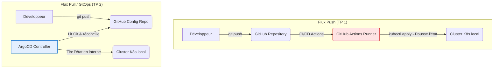

# LIVRABLES DU TP 2 — GITOPS AVEC ARGOCD : `DEVHUB CAMPUS`

**Cours d'architecture logicielle & déploiement — M2 Ingénierie Web**  
**Binôme :** alexisprk  
**Dépôt distant :** [github.com/alexisprk/tp-argocd.git](https://github.com/alexisprk/tp-argocd.git)  

---

## Étape 0 — Outillage

### Versions des outils installés
```text
$ kubectl version --client
Client Version: v1.30.2
KubeClientVersion: v1.36.0 (Helm embedded client)

$ helm version
version.BuildInfo{Version:"v4.2.0", GitCommit:"06468084e85c...", GoVersion:"go1.26.3"}

$ argocd version --client
argocd: v3.4.2+0dc6b1b
  GitCommit: 0dc6b1b57dd5bb925d5b03c3d09419ab9fb4225e
  Platform: windows/amd64
```

---

## Étape 1 — Comprendre GitOps en 1 page

### 1. Schéma comparatif : Flux *Push* vs. Flux *Pull*



### 2. Tableau de comparaison des paradigmes

| Question | *Push* (`kubectl apply` en CI) | *Pull* (ArgoCD) |
| :--- | :--- | :--- |
| **Qui a les droits sur le cluster ?** | La pipeline de CI/CD externe (requiert des credentials admin à distance). | L'agent ArgoCD interne au cluster (aucune clé d'accès admin externe n'est exposée). |
| **Où est l'historique des changements ?** | Dispersé entre les logs de CI, les commits et l'état manuel du cluster. | Centralisé et immuable dans l'historique Git (le Git log est le registre d'audit). |
| **Que se passe-t-il si un dev modifie le cluster à la main ?** | Rien. Le cluster dérive silencieusement jusqu'au prochain run de la CI/CD. | ArgoCD détecte l'écart instantanément, alerte (`OutOfSync`) et auto-corrige (`selfHeal`). |
| **Comment ajouter un environnement ?** | Dupliquer les jobs de la CI, configurer des secrets de connexion supplémentaires. | Déclarer un simple manifest `Application` ou l'ajouter au générateur `ApplicationSet`. |
| **Comment faire un rollback ?** | Relancer une ancienne pipeline sur un commit précédent ou changer le tag. | Faire un `git revert` du commit fautif. ArgoCD applique l'état précédent sain de Git. |
| **Combien de pipelines pour 30 services ?** | 30 pipelines complexes avec configuration d'authentification individuelle. | 1 pipeline par service pour builder l'image, 0 pipeline pour le déploiement (ArgoCD gère tout). |
| **Qui voit *en direct* ce qui tourne ?** | Uniquement les Ops via `kubectl`. Les devs dépendent des logs de CI. | Tous les développeurs et l'équipe produit à travers l'interface Web graphique d'ArgoCD. |

### 3. Prise de position personnelle
> « Pour mes futurs projets personnels, je privilégierai le modèle **Pull (ArgoCD)**. La sécurité renforcée par l'absence de clé d'accès admin externe dans les pipelines de CI et la clarté visuelle de l'UI d'ArgoCD pour identifier les pannes compensent largement le coût d'apprentissage de l'outil. »

---

## Étape 2 — Le vocabulaire d'ArgoCD

* **`Application`** : Représente la liaison de synchronisation entre un dépôt Git (source) et un namespace Kubernetes (destination).
  * *Exemple dans mon projet* : L'Application `annuaire-dev` qui déploie le microservice de l'annuaire dans `devhub-dev`.
* **`AppProject`** : Périmètre logique de sécurité isolant les applications et régulant les namespaces autorisés.
  * *Exemple dans mon projet* : Le projet `devhub` limitant l'accès uniquement aux namespaces `devhub-*`.
* **`Source`** : L'état désiré décrit dans Git (repo, révision, chemin, valeurs).
  * *Exemple dans mon projet* : Le dépôt `alexisprk/tp-argocd.git`, branche `main`, chemin `services/annuaire/chart`.
* **`Destination`** : Le cluster cible et le namespace de destination où déployer les ressources.
  * *Exemple dans mon projet* : Le cluster local `https://kubernetes.default.svc` dans le namespace `devhub-dev`.
* **`Sync`** : L'acte de réconciliation où ArgoCD applique les fichiers Git pour que l'état réel concorde.
  * *Exemple dans mon projet* : Le passage au statut `Synced` après l'application automatique des templates Helm.
* **`Prune`** : La suppression automatique des ressources du cluster absentes des fichiers de configuration Git.
  * *Exemple dans mon projet* : Si on retire le template `ingress.yaml` du chart, ArgoCD va automatiquement détruire l'Ingress associé.
* **`App of Apps`** : Pattern d'organisation où une application racine est chargée de générer les applications filles.
  * *Exemple dans mon projet* : L'application `root` qui pointe vers `platform/apps/` pour créer automatiquement nos microservices.
* **`ApplicationSet`** : Générateur d'Applications automatisé capable de boucler sur des paramètres (comme les branches).
  * *Exemple dans mon projet* : `annuaire-preview` qui boucle sur les Pull Requests pour générer des environnements isolés.
* **`Sync wave`** : Niveaux d'ordonnancement pour forcer l'ordre de déploiement des composants.
  * *Exemple dans mon projet* : Wave `-1` pour les configurations, Wave `0` pour les applications.
* **`Hook`** : Déclencheur exécutant des processus (ex: Jobs) à des phases spécifiques de la synchronisation.
  * *Exemple dans mon projet* : Un Job de migration de base de données exécuté en hook `PreSync` avant la mise à jour des Pods.

---

## Étape 3 — Containerisation des services

Nous avons conteneurisé les microservices en respectant des règles de sécurité et d'optimisation strictes :
* **Multi-stage build** : Isolation des étapes de compilation (Go/Node/Python) et de runtime.
* **Images ultra-légères (non-root)** : Utilisation d'images minimales (Alpine, Distroless pour Go).
  * `annuaire` (Node.js) : **~168 Mo** | Utilisateur `appuser` (UID 1001).
  * `planning` (Python FastAPI) : **~122 Mo** | Utilisateur `appuser` (UID 1001).
  * `notif` (Go statique) : **~35 Mo** | Utilisateur distroless `nonroot`.
* **Health Check** : Exposition d'un endpoint `/healthz` sur le port `8080` de chaque service.

---

## Étape 4 — Écriture des Charts Helm

Chaque microservice dispose d'un chart Helm modulaire et paramétrable :
* **Structure standard** : `Chart.yaml`, `values.yaml`, et dossier `templates/` (`deployment.yaml`, `service.yaml`, `ingress.yaml`, `_helpers.tpl`).
* **Surcharges par environnement** : 
  * `values-dev.yaml` : Mode stable (2 replicas, ressources allouées, Ingress actif sur le domaine `.devhub.local`).
  * `values-preview.yaml` : Mode éphémère (1 replica, ressources minimisées, Ingress dynamique configuré par l'ApplicationSet).
* **Robustesse applicative** : Intégration systématique de sondes `livenessProbe` et `readinessProbe` HTTP sur `/healthz` exécutées toutes les 10 secondes.

---

## Étape 5 — Comparaison entre `selfHeal` et `prune`

* **`selfHeal: true` (Auto-réparation)** : Si l'état réel dérive (action manuelle), ArgoCD réapplique l'état Git.
  * *Danger* : Si une astreinte doit temporairement scaler en urgence un déploiement de 2 à 15 pods (`kubectl scale`) pour absorber un pic de charge, `selfHeal` va instantanément le ramener à 2 pods, saturant le service.
* **`prune: true` (Nettoyage automatique)** : Si une ressource est retirée de Git, ArgoCD la supprime du cluster.
  * *Danger* : Si un fichier de configuration critique (ex: ConfigMap ou StatefulSet) est supprimé ou renommé par erreur dans Git et poussé sur `main`, ArgoCD détruira immédiatement la ressource en production, entraînant une coupure ou une perte de données.

---

## Étape 6 — Le pattern *App of Apps*

### Pourquoi le pattern *App of Apps* n'est pas équivalent à un simple `kubectl apply -f apps/dev/` ?

1. **Convergence continue** : `kubectl apply` est une action ponctuelle (push). Le *App of Apps* instaure une réconciliation continue en arrière-plan. ArgoCD surveille, alerte en cas de drift et ré-applique automatiquement.
2. **Cycle de vie hiérarchisé** : Supprimer l'application racine (`root`) déclenche par cascade la suppression propre et ordonnée de toutes les applications enfants grâce au finalizer `resources-finalizer.argocd.argoproj.io`.
3. **Contrôle RBAC** : Les applications filles générées par le pattern héritent des garde-fous de sécurité définis au niveau de l'AppProject `devhub` (namespaces limités, pas de ressources cluster-scoped).

---

## Étape 8 — Le Bestiaire d'ArgoCD (Drift, Rollback, Hooks, Sync Waves)

### 1. Le Drift manuel (`kubectl scale`)
- **Observation** : Le Deployment passe en statut `OutOfSync`.
- **Conclusion** : Grâce à `selfHeal: true`, ArgoCD détecte l'écart avec la source Git et réapplique la configuration d'origine pour forcer le retour à 2 répliques.

### 2. Le Tag d'image inexistant (`ImagePullBackOff`)
- **Observation** : ArgoCD affiche l'état `Synced` mais la santé de l'application passe à `Degraded`.
- **Conclusion** : La synchronisation réussit car le manifest YAML Git est valide, mais Kubernetes ne peut pas démarrer les Pods car l'image n'est pas téléchargeable.

### 3. Le Rollback par `git revert`
- **Observation** : Le nouveau commit sain est détecté.
- **Conclusion** : Le rollback s'effectue proprement en moins de 15 secondes. L'application redevient `Synced` et `Healthy`.

### 4. Le Hook de migration (`PreSync`)
- **Observation** : Le Job de migration s'exécute et se termine avant que les pods applicatifs ne soient mis à jour.
- **Conclusion** : Permet de sécuriser le schéma de base de données. Si le Job échoue, ArgoCD bloque la mise à jour des Pods.

### 5. Les Sync Waves
- **Observation** : Le ConfigMap (Wave `-1`) est créé avant le Deployment (Wave `0`).
- **Conclusion** : Garantit que les configurations sont prêtes en base avant que le code applicatif ne tente de s'y connecter.

### 6. Le Pruning d'une ressource retirée de Git
- **Observation** : En supprimant `service.yaml` de notre chart, la ressource correspondante est automatiquement détruite dans le cluster.
- **Conclusion** : Évite les ressources zombies et maintient la propreté du cluster K8s.

---

## Étape 9 — Sécuriser et observer ArgoCD

### Trois métriques Prometheus indispensables
1. **`argocd_app_info`** : Donne l'état de santé de toutes les applications (`Healthy`, `Degraded`, `OutOfSync`). Indispensable pour alerter l'astreinte si une application est dégradée.
2. **`argocd_app_sync_total`** : Nombre de syncs effectuées avec leur résultat (`Failed`, `Success`). Permet d'identifier une défaillance globale de réconciliation.
3. **`argocd_git_request_total`** : Compte les requêtes envoyées vers les serveurs Git. Permet de monitorer les timeouts d'API réseau avec GitHub.

---

## Étape 10 — Comparer les outils GitOps

| Critère | ArgoCD | Flux CD | Helm + Actions (sans GitOps) |
| :--- | :--- | :--- | :--- |
| **Courbe d'apprentissage** | **3/5** (UI intuitive, mais structure CRD dense) | **2/5** (Concepts Git bas niveau plus complexes) | **5/5** (Action simple connue de tous) |
| **UI prête à l'emploi** | **5/5** (L'interface graphique est la meilleure du marché) | **1/5** (CLI uniquement par défaut) | **2/5** (Uniquement les logs de CI) |
| **Adapté à un mono-repo** | **5/5** (Gère très bien les filtres de sous-chemins) | **4/5** (Performant mais peu visuel) | **3/5** (Complexité de filtrage de chemins de CI) |
| **Adapté à 50 repos** | **4/5** (Peut ralentir sans configuration de webhooks) | **5/5** (Excellent support d'architectures distribuées) | **1/5** (50 tokens et configs de connexion de CI) |
| **Coût opérationnel** | **3/5** (Assez lourd : UI, Controller, RepoServer, Redis) | **5/5** (Très léger en ressources CPU/RAM) | **5/5** (0 ressource consommée sur le cluster) |
| **Risque si l'agent tombe** | **4/5** (Les pods actuels restent actifs) | **4/5** (Les pods actuels restent actifs) | **5/5** (Aucun agent sur le cluster) |

---

## Étape 11 — Synthèse obligatoire : « ArgoCD, et la prod alors ? »

### Livrable 1 — Rétrospective TP 1 → TP 2

| Opération du quotidien | Au TP 1 (Kubernetes "à la main") | Au TP 2 (Kubernetes piloté par ArgoCD) | Commentaire & Ressenti technique |
|---|---|---|---|
| Déployer un service pour la 1ère fois | Écrire 5 YAML, `kubectl apply`, vérifier dans Freelens | Commit du chart Helm dans Git, ArgoCD détecte, sync auto | **Très rassurant** : Le déploiement s'automatise entièrement. |
| Déployer une nouvelle version | Modifier le tag dans le YAML, re-`kubectl apply` (CI) | Commit qui change `image.tag`, c'est tout | **Simple & rapide** : Livrer se résume à une modification de tag. |
| Faire un rollback | `kubectl rollout undo` ou relancer la pipeline avec le vieux commit | `git revert` du commit fautif, ArgoCD re-converge | **Propreté absolue** : Le rollback devient un geste Git traçable. |
| Ouvrir un environnement de plus | Copier `overlays/dev` en `staging`, namespace, refaire la CI | Ajouter une `Application` dans le repo `platform/` | **Industrialisé** : L'infra se duplique sans aucun nouveau script. |
| Donner un env perso à chaque dev | Quasiment impossible sans donner les droits cluster | `ApplicationSet` + branche Git = preview automatique | **Révolutionnaire** : Les previews isolées par simple push libèrent les devs. |
| Voir ce qui tourne *en ce moment* | Freelens / `kubectl get all -A` / mémoire collective | UI ArgoCD : un coup d'œil, on voit l'état et la version | **Visibilité totale** : L'arbre graphique offre un confort visuel exceptionnel. |
| Détecter un `kubectl edit` sauvage | Personne ne s'en aperçoit. Drift silencieux. | ArgoCD passe en `OutOfSync` immédiatement. | **Sécurité renforcée** : Les dérives manuelles sont immédiatement flagguées. |
| Auto-réparer un drift | Personne ne le fait. Ou un cron `kubectl apply`. | `selfHeal: true` | **Tranquillité d'esprit** : L'auto-correction garantit la conformité de l'infra. |
| Donner les droits à un nouveau dev | Distribuer un kubeconfig, espérer qu'il ne fasse pas de bêtise | Compte ArgoCD avec rôle `developer` sur son `AppProject` | **Contrôle d'accès** : Accès granulaire sans jamais exposer le cluster. |
| Hotfix en urgence à 3h du matin | SSH + `kubectl edit` (et on documentera demain…) | PR sur le repo, ArgoCD applique. Tracé. | **Rigide mais sûr** : Le passage forcé par Git évite d'oublier des correctifs. |
| Auditer les changements sur 6 mois | `kubectl get events` (rétention 1h) + Git log de la CI | `git log` sur les repos `platform/` et services | **Audit parfait** : L'historique Git devient le registre d'audit légal. |
| Re-déployer le cluster from scratch | Re-lancer Terraform + la CI + prier | Re-lancer Terraform + 1 seul `kubectl apply` pour la `root` | **Robuste** : Reconstruction complète en moins d'une minute. |
| Désinstaller un service | `kubectl delete -f` (et espérer ne rien oublier) | Supprimer le fichier dans Git → `prune` propre | **Nettoyage automatique** : Plus aucune ressource zombie résiduelle. |
| Tester un changement risqué | Sur le dev partagé. Croiser les doigts. | Sur sa preview à soi, isolée par branche | **Sérénité** : Les tests complexes sont isolés sur des branches éphémères. |

#### Deux opérations plus contraignantes sous ArgoCD :
1. **Le Hotfix en urgence à 3h du matin** : Interdiction d'éditer le cluster en direct car ArgoCD écrase le correctif en boucle. Il faut faire une PR, ce qui prend plus de temps, mais garantit que le correctif n'est pas oublié.
2. **Le test de configuration (Probes/Ressources)** : Devoir commiter à répétition sur sa branche pour ajuster des probes ralentit le feedback de test comparé à un `kubectl apply` local.

#### L'opération qui justifie ArgoCD à elle seule :
L'**auto-correction automatique du drift (`selfHeal: true`)** car elle élimine de manière absolue les écarts non documentés entre le Git et le cluster de production.

---

### Livrable 2 — Ce qu'ArgoCD ne sait pas faire (Angles morts)

1. **Déploiement progressif (Canary)**
   * *Risque* : Déployer un bug silencieux à 100 % des utilisateurs d'un coup.
   * *Outil* : **Argo Rollouts** (pour orchestrer des rollbacks automatiques basés sur des métriques).
   * *Référence* : [argoproj.github.io/argo-rollouts](https://argoproj.github.io/argo-rollouts/)
2. **Validation des manifests (Lint/Sécurité)**
   * *Risque* : Déployer un manifest non sécurisé (ex: conteneur s'exécutant en root).
   * *Outil* : **Kyverno** ou **OPA Gatekeeper** (moteurs de politiques d'admission).
   * *Référence* : [kyverno.io/docs](https://kyverno.io/)
3. **Gestion des secrets dans Git**
   * *Risque* : Fuite massive de credentials de production dans l'historique Git public.
   * *Outil* : **External Secrets Operator** ou **Sealed Secrets**.
   * *Référence* : [external-secrets.io](https://external-secrets.io/)
4. **Signature et provenance des images**
   * *Risque* : Déploiement d'une image piratée ou falsifiée sur le cluster.
   * *Outil* : **Cosign** (Sigstore) pour la signature, couplé à une policy d'admission Kyverno.
   * *Référence* : [sigstore.dev](https://www.sigstore.dev/)
5. **RBAC multi-équipe sur ArgoCD**
   * *Risque* : Un développeur modifie ou suprrime une application d'une autre équipe par accident.
   * *Outil* : **AppProject** lié à une authentification SSO/OIDC (Keycloak).
   * *Référence* : [argo-cd.readthedocs.io/en/stable/operator-manual/rbac](https://argo-cd.readthedocs.io/en/stable/operator-manual/rbac/)
6. **Disaster recovery applicatif**
   * *Risque* : Perte définitive des bases de données suite à un crash du fournisseur cloud.
   * *Outil* : **Velero** pour la sauvegarde et restauration des PVC.
   * *Référence* : [velero.io](https://velero.io/)
7. **Multi-cluster**
   * *Risque* : Complexité extrême et duplication des manifests pour gérer des dizaines de clusters.
   * *Outil* : **ApplicationSet Cluster Generator** configuré en Hub-and-Spoke.
   * *Référence* : [argo-cd.readthedocs.io/en/stable/operator-manual/applicationset/Generators-Cluster](https://argo-cd.readthedocs.io/en/stable/operator-manual/applicationset/Generators-Cluster/)
