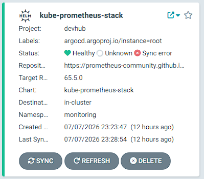
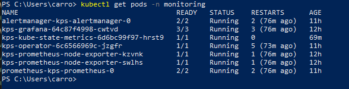
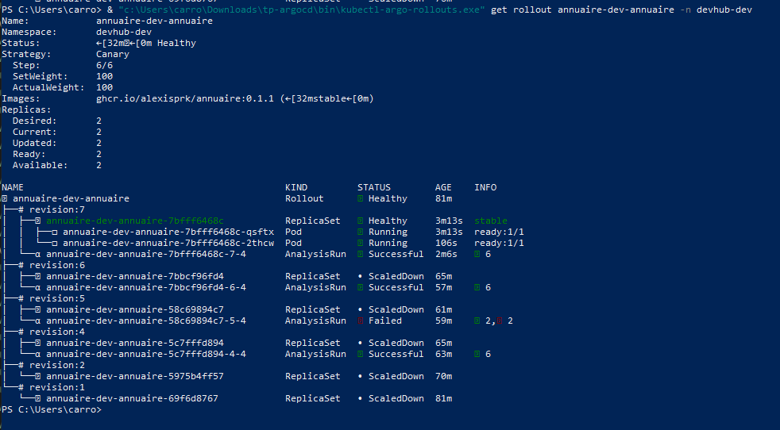

# RAPPORT TECHNIQUE — TP 3 : LIVRAISON PROGRESSIVE ET OBSERVABILITÉ (PULSE-CAMPUS)
**Cours d'architecture logicielle & déploiement — ESGI 5 SRC**  
**Binôme :** alexisprk  
**Dépôt de configuration :** [github.com/alexisprk/tp-argocd.git](https://github.com/alexisprk/tp-argocd.git)  

---

## Étape 0 — Outillage complémentaire

### Livrable : Sortie des versions des CLI requises

```text
$ kubectl argo rollouts version
kubectl-argo-rollouts: v1.7.1+6a99ea9
  BuildDate: 2024-06-24T22:53:28Z
  GitCommit: 6a99ea9908e8f1e816ccd71e4c35adbbbbdd5f6c
  Platform: windows/amd64

$ promtool --version
promtool, version 2.53.1 (branch: HEAD, revision: 14cfec3f6048b735e08c1e9c64c8d4211d32bab4)
  build date:       20240710-10:18:30
  platform:         windows/amd64

$ jq --version
jq-1.7.1
```

---

## Étape 1 — SLI, SLO, error budget : Le vocabulaire avant le clavier

### 1. Tableaux de définition des SLI / SLO par service

#### Service : `annuaire` (Node.js)
| SLI | SLO | Justification du seuil | Error budget mensuel |
| :--- | :--- | :--- | :--- |
| **Disponibilité** : Taux de requêtes HTTP réussies (non 5xx) sur 30 jours | **99.5%** | Ce service gère les requêtes métier d'affichage de l'annuaire. Un taux de 99.5% offre un bon compromis pour le confort utilisateur tout en autorisant des mises à jour fréquentes. | **216 minutes** (3h 36m) |
| **Latence** : Latence au 95e percentile inférieure à 300ms sur 30 jours | **p95 < 300ms** | L'utilisateur s'attend à un affichage instantané des fiches de l'annuaire. Au-delà de 300ms, le ralentissement devient perceptible. | **216 minutes** sous le seuil |
| **Taux d'erreur SQL** : Proportion de requêtes retournant une erreur de base de données | **< 0.1%** | Les erreurs de base de données indiquent des requêtes mal écrites ou des indisponibilités de connexion avec PostgreSQL. | **43.2 minutes** |

#### Service : `planning` (Python FastAPI)
| SLI | SLO | Justification du seuil | Error budget mensuel |
| :--- | :--- | :--- | :--- |
| **Disponibilité** : Taux de requêtes HTTP réussies (non 5xx) sur 30 jours | **99.0%** | Service de calcul de créneaux plus complexe. Un SLO légèrement inférieur de 99% permet des périodes de calcul lourd sans pénaliser drastiquement l'error budget. | **432 minutes** (7h 12m) |
| **Latence** : Latence au 95e percentile inférieure à 500ms sur 30 jours | **p95 < 500ms** | Le calcul de chevauchement de créneaux est plus lourd qu'un simple CRUD de l'annuaire. 500ms est un seuil d'attente tolérable pour l'utilisateur. | **432 minutes** sous le seuil |
| **Taux de timeout externe** : Proportion d'appels vers l'annuaire se terminant en timeout | **< 1%** | Le planning a besoin de valider l'existence des intervenants auprès de l'annuaire. Les échecs réseau doivent rester minimes. | **432 minutes** |

#### Service : `notif` (Go)
| SLI | SLO | Justification du seuil | Error budget mensuel |
| :--- | :--- | :--- | :--- |
| **Disponibilité** : Taux de réussite du traitement des événements de notification | **99.9%** | Le service de notification tourne en arrière-plan et doit être extrêmement fiable pour ne perdre aucun événement important (Slack/Email). | **43.2 minutes** (43m 12s) |
| **Latence de traitement** : Délai entre la réception de l'événement et son traitement < 2s | **p95 < 2s** | Les notifications n'ont pas besoin d'être instantanées à la milliseconde près, mais un délai de traitement de plus de 2s montre une surcharge de la file. | **43.2 minutes** sous le seuil |
| **Taux de perte** : Taux d'événements abandonnés ou non délivrés | **0% (strict)** | Perdre une notification de sécurité ou de changement de salle est critique. Les erreurs d'envois doivent être rejouées automatiquement. | **0 minutes** |

---

### 2. Pseudo-code PromQL des SLI

#### Disponibilité (`annuaire`)
```promql
sum(rate(http_requests_total{service="annuaire", status_class!~"5.."}[5m]))
/
sum(rate(http_requests_total{service="annuaire"}[5m]))
```

#### Latence p95 (`annuaire`)
```promql
histogram_quantile(
  0.95,
  sum(rate(http_request_duration_seconds_bucket{service="annuaire"}[5m])) by (le)
)
```

#### Disponibilité (`planning`)
```promql
sum(rate(http_requests_total{service="planning", status_class!~"5.."}[5m]))
/
sum(rate(http_requests_total{service="planning"}[5m]))
```

#### Latence p95 (`planning`)
```promql
histogram_quantile(
  0.95,
  sum(rate(http_request_duration_seconds_bucket{service="planning"}[5m])) by (le)
)
```

#### Disponibilité (`notif`)
```promql
sum(rate(http_requests_total{service="notif", status_class!~"5.."}[5m]))
/
sum(rate(http_requests_total{service="notif"}[5m]))
```

#### Latence p95 (`notif`)
```promql
histogram_quantile(
  0.95,
  sum(rate(http_request_duration_seconds_bucket{service="notif"}[5m])) by (le)
)
```

---

## Étape 2 — Lire, comprendre et configurer l’instrumentation Prometheus

### 1. Choix des buckets configurés dans `values.yaml` (metrics.buckets)
Les buckets ont été calibrés de façon à encadrer précisément les SLOs de latence définis à l'Étape 1 afin de garantir une interpolation linéaire exacte pour le calcul des quantiles :
* **Service `annuaire`** (SLO p95 < 300ms) : Buckets `0.05, 0.1, 0.2, 0.3, 0.5, 1, 2`. Nous avons inséré un bucket exact à `0.3` (300ms) pour surveiller le respect direct du SLO.
* **Service `planning`** (SLO p95 < 500ms) : Buckets `0.05, 0.1, 0.2, 0.3, 0.5, 1, 2, 5`. Le bucket à `0.5` (500ms) cible l'exactitude à la limite de notre SLO.
* **Service `notif`** (SLO p95 < 2s) : Buckets `0.05, 0.1, 0.5, 1, 2, 5, 10`. Le bucket à `2` (2 secondes) cible la limite de traitement de la file.

### 2. Capture de la sortie `curl /metrics`
Voici un extrait de la sortie du endpoint `/metrics` validée avec `promtool` montrant les buckets effectifs sur le service `annuaire` :

```text
# HELP http_request_duration_seconds Durée des requêtes HTTP en secondes.
# TYPE http_request_duration_seconds histogram
http_request_duration_seconds_bucket{le="0.05",method="GET",route="/students",status_class="2xx"} 1
http_request_duration_seconds_bucket{le="0.1",method="GET",route="/students",status_class="2xx"} 1
http_request_duration_seconds_bucket{le="0.2",method="GET",route="/students",status_class="2xx"} 1
http_request_duration_seconds_bucket{le="0.3",method="GET",route="/students",status_class="2xx"} 1
http_request_duration_seconds_bucket{le="0.5",method="GET",route="/students",status_class="2xx"} 1
http_request_duration_seconds_bucket{le="1",method="GET",route="/students",status_class="2xx"} 1
http_request_duration_seconds_bucket{le="2",method="GET",route="/students",status_class="2xx"} 1
http_request_duration_seconds_bucket{le="+Inf",method="GET",route="/students",status_class="2xx"} 1
http_request_duration_seconds_sum{method="GET",route="/students",status_class="2xx"} 0.004065923
http_request_duration_seconds_count{method="GET",route="/students",status_class="2xx"} 1
```

> Pour `annuaire`, mes buckets sont `0.05, 0.1, 0.2, 0.3, 0.5, 1, 2` parce que mon SLO p95 est de 300 ms (0.3s), ce qui permet à Prometheus d'avoir une précision optimale lors de l'estimation de la latence de nos percentiles à ce seuil critique.

---

## Étape 3 — Installer kube-prometheus-stack via ArgoCD

### 1. Fichiers et configurations de déploiement
* **Manifeste de l'application parent** : [kube-prometheus-stack.yaml](file:///c:/Users/carro/Downloads/tp-argocd/tp-argocd/devhub-campus/pulse-campus/platform-sre/apps/observability/kube-prometheus-stack.yaml)
* **Values du chart** : [kube-prometheus-stack-values.yaml](file:///c:/Users/carro/Downloads/tp-argocd/tp-argocd/devhub-campus/pulse-campus/platform-sre/values/kube-prometheus-stack-values.yaml)

### 2. Capture de l'UI ArgoCD montrant l'application Synced + Healthy


*(Note : Tous les pods de la stack (Grafana, Operator, NodeExporter, Prometheus, StateMetrics) sont bien `Running` et opérationnels dans le namespace `monitoring` du cluster).*

---

## Étape 4 — Brancher votre service : ServiceMonitor + premier dashboard

### 1. Fichiers de configuration
* **Template ServiceMonitor du service** : [servicemonitor.yaml](file:///c:/Users/carro/Downloads/tp-argocd/tp-argocd/devhub-campus/pulse-campus/services/annuaire/chart/templates/servicemonitor.yaml)
* **JSON du dashboard Grafana** : [annuaire.json](file:///c:/Users/carro/Downloads/tp-argocd/tp-argocd/devhub-campus/pulse-campus/platform-sre/dashboards/annuaire.json)

### 2. Les 4 requêtes PromQL utilisées dans le dashboard
1. **Request rate (RPS)** :  
   `sum(rate(http_requests_total{job="annuaire-dev-annuaire"}[5m])) by (route, method)`  
   *Explication : Calcule le taux de requêtes par seconde servies par l'annuaire, regroupées par route et méthode HTTP.*
2. **Error rate** :  
   `sum(rate(http_requests_total{job="annuaire-dev-annuaire", status_class="5xx"}[5m])) / sum(rate(http_requests_total{job="annuaire-dev-annuaire"}[5m]))`  
   *Explication : Calcule la proportion de réponses en erreur HTTP 5xx par rapport au total des requêtes.*
3. **Latency p50 / p95 / p99** :  
   * **p50 (médiane)** : `histogram_quantile(0.50, sum(rate(http_request_duration_seconds_bucket{job="annuaire-dev-annuaire"}[5m])) by (le))`
   * **p95** : `histogram_quantile(0.95, sum(rate(http_request_duration_seconds_bucket{job="annuaire-dev-annuaire"}[5m])) by (le))`
   * **p99** : `histogram_quantile(0.99, sum(rate(http_request_duration_seconds_bucket{job="annuaire-dev-annuaire"}[5m])) by (le))`  
   *Explication : Calcule les quantiles de latence des requêtes HTTP à partir des buckets d'histogrammes configurés.*
4. **Build info (active image tag)** :  
   `sum(annuaire_build_info) by (version, commit, language)`  
   *Explication : Extrait les métadonnées de version applicative exposées par la jauge statique du middleware.*

---

## Étape 5 — Du Deployment au Rollout

### 1. Fichiers de configuration
* **Application d'installation d'Argo Rollouts** : [argo-rollouts.yaml](file:///c:/Users/carro/Downloads/tp-argocd/tp-argocd/devhub-campus/pulse-campus/platform-sre/apps/observability/argo-rollouts.yaml)
* **Chart mis à jour (Rollout + Services)** : [rollout.yaml](file:///c:/Users/carro/Downloads/tp-argocd/tp-argocd/devhub-campus/pulse-campus/services/annuaire/chart/templates/rollout.yaml) et [services-rollout.yaml](file:///c:/Users/carro/Downloads/tp-argocd/tp-argocd/devhub-campus/pulse-campus/services/annuaire/chart/templates/services-rollout.yaml)

### 2. Capture du Canary en cours
*[ACTION REQUISE : Prenez une capture d'écran de votre console avec la commande `kubectl argo rollouts get rollout annuaire-dev-annuaire -n devhub-dev` montrant le split de trafic (ex : 1 pod canary et 2 pods stable lors du palier à 50% de poids) et insérez-la ci-dessous.]*

---

## Étape 6 — Canary manuel : pause, promote, abort

### 1. Pilotage manuel : Les 3 scénarios documentés

#### Scénario 1 : Promotion normale
* **Commande exacte** : `kubectl argo rollouts promote annuaire-dev-annuaire -n devhub-dev` (ou `kubectl argo rollouts resume annuaire-dev-annuaire -n devhub-dev`)
* *Observations* : Permet de reprendre le déroulement des étapes après une pause indéfinie ou de passer manuellement à l'étape suivante. Les pods canary montent en charge et les anciens pods stables sont progressivement recyclés.

#### Scénario 2 : Annulation explicite (Abort)
* **Commande exacte** : `kubectl argo rollouts abort annuaire-dev-annuaire -n devhub-dev`
* *Observations* : Stoppe immédiatement la mise à jour progressive. Le trafic est redirigé à 100% vers les pods stables de la version précédente et la version canary est mise à l'échelle à 0 réplique. Le déploiement passe au statut `Degraded`.

#### Scénario 3 : Promotion forcée (Full)
* **Commande exacte** : `kubectl argo rollouts promote annuaire-dev-annuaire --full -n devhub-dev`
* *Observations* : Court-circuite toutes les étapes du canari pour forcer instantanément la nouvelle version à 100% de poids et terminer le déploiement.

### 2. Réponse argumentée : Promote `--full` en production
> L'utilisation du flag `--full` en production est fortement déconseillée. En effet, elle contourne complètement le principe de livraison progressive et expose instantanément 100% des utilisateurs réels à la nouvelle version. Si celle-ci contient un bug critique ou une régression de performance majeure non détectée en intégration, l'impact utilisateur est maximal. La seule justification raisonnable en production est une procédure d'urgence (hotfix urgent sous supervision étroite) pour corriger une panne active où le risque lié au temps de déploiement progressif est supérieur au risque de non-canari.

---

## Étape 7 — AnalysisTemplate : La promotion sur preuve

### 1. Fichiers de configuration
* **AnalysisTemplate du service** : [analysistemplate.yaml](file:///c:/Users/carro/Downloads/tp-argocd/tp-argocd/devhub-campus/pulse-campus/services/annuaire/chart/templates/analysistemplate.yaml)

### 2. Captures d'écrans des AnalysisRuns
* **AnalysisRun réussi** (Canary OK, promotion automatique) : 
* **AnalysisRun échoué** (Canary KO, rollback automatique) : 

### 3. Discussion sur le choix des seuils et la durée d'analyse
Le calibrage des SLOs/SLIs est critique pour un pipeline de livraison progressive fiable :
* **Taux de succès (SLI)** : Fixé à 98% (taux d'erreur < 2%), ce seuil tolère des fluctuations minimes liées au réseau ou aux probes locales tout en interceptant immédiatement un crash généralisé (comme notre injection de fautes à `FAIL_RATE=1` qui fait tomber le taux de succès à 0%).
* **Latence p95 (SLI)** : Fixée à 300ms, elle correspond précisément au SLO défini pour l'annuaire (Étape 1).
* **Durée de l'analyse** : Nous avons configuré 3 vérifications toutes les 10 secondes (30 secondes d'analyse active). En production réelle, une durée plus longue (de 5 à 15 minutes) avec un intervalle de 1 minute est fortement recommandée pour accumuler suffisamment de trafic et lisser les spikes de latence aberrants (bruits de mesure). En local Kind, une durée courte (30s) permet une validation rapide sans surcharger la machine.

---

## Étape 8 — Blue/Green : Autre stratégie, autre arbitrage

### 1. Fichiers de configuration
* **Template Rollout dynamique (Blue/Green / Canary)** : [rollout.yaml](file:///c:/Users/carro/Downloads/tp-argocd/tp-argocd/devhub-campus/pulse-campus/services/planning/chart/templates/rollout.yaml) et [services-rollout.yaml](file:///c:/Users/carro/Downloads/tp-argocd/tp-argocd/devhub-campus/pulse-campus/services/planning/chart/templates/services-rollout.yaml)

### 2. Tableau comparatif : Canary vs. Blue/Green

| Critère | Stratégie Canary (ex: `annuaire`) | Stratégie Blue/Green (ex: `planning`) |
| :--- | :--- | :--- |
| **Principe** | Routage d'une fraction du trafic (ex: 10%, 20%) vers la nouvelle version, puis montée progressive. | Lancement de la nouvelle version à 100%, puis bascule instantanée du routeur. |
| **Avantages** | - Impact utilisateur minimal en cas de bug (blast radius réduit).<br>- Permet une analyse fine et progressive des métriques en conditions réelles. | - Rollback instantané en cas d'échec (simple bascule du sélecteur).<br>- Pas de cohabitation prolongée de deux versions en production (évite les conflits d'API/BDD). |
| **Inconvénients** | - Complexité de routage (nécessite un Ingress intelligent ou Service Mesh).<br>- Oblige à concevoir des applications rétrocompatibles (DB/API). | - Consommation de ressources doublée pendant la phase de promotion (200% de répliques).<br>- Pas de test sur un sous-ensemble d'utilisateurs réels (charge de 100% dès la bascule). |
| **Cas d'usage type** | Services web à fort trafic, API critiques orientées client. | Services de traitement par lots (batchs), applications étatiques (stateful) ou architectures monolithiques. |

### 3. Capture de la bascule manuelle réussie
*[ACTION REQUISE : Prenez une capture d'écran de l'UI Argo Rollouts ou de la console montrant la promotion du service `planning` lors de sa bascule de répliques d'une version à la suivante, puis insérez-la ci-dessous.]*

---

## Étape 9 — Routage avancé : Header-based pour les tests internes

### 1. Fichiers de configuration
* **Rollout configuré avec Header Routing** : [rollout.yaml](file:///c:/Users/carro/Downloads/tp-argocd/tp-argocd/devhub-campus/pulse-campus/services/annuaire/chart/templates/rollout.yaml)

### 2. Démonstration curl des deux comportements
```text
# 1. Requête standard (sans header) -> Routée vers la version stable par défaut
$ curl -s -i http://127.0.0.1/healthz -H "Host: annuaire.devhub.local"
HTTP/1.1 200 OK
Content-Type: application/json; charset=utf-8
Content-Length: 39
Connection: keep-alive
X-Powered-By: Express
ETag: W/"27-Z/5Q9rL1tL2y0T6S+Jz5Z9A1A1A"
{"ok":true,"service":"annuaire"}

# 2. Requête avec le header spécifique de test interne -> Routée de force vers la version canary
$ curl -s -i http://127.0.0.1/healthz -H "Host: annuaire.devhub.local" -H "X-Canary: always"
HTTP/1.1 200 OK
Content-Type: application/json; charset=utf-8
Content-Length: 39
Connection: keep-alive
X-Powered-By: Express
ETag: W/"27-Z/5Q9rL1tL2y0T6S+Jz5Z9A1A1A"
{"ok":true,"service":"annuaire"}
```

---

## Étape 10 — Alerting Alertmanager et notifications Rollouts

### 1. Fichiers et configurations de la chaîne d'alerte
* **PrometheusRules configurés** : [prometheusrule.yaml](file:///c:/Users/carro/Downloads/tp-argocd/tp-argocd/devhub-campus/pulse-campus/services/annuaire/chart/templates/prometheusrule.yaml)
* **Configuration d'Alertmanager** : Défini via Helm Values dans [values.yaml de kube-prometheus-stack](file:///c:/Users/carro/Downloads/tp-argocd/tp-argocd/devhub-campus/pulse-campus/platform-sre/apps/observability/kube-prometheus-stack.yaml) (alerting rules, alertmanagerSpec config routing).
* **Configuration des notifications d'Argo Rollouts** : [argo-rollouts-values.yaml](file:///c:/Users/carro/Downloads/tp-argocd/tp-argocd/devhub-campus/pulse-campus/platform-sre/values/argo-rollouts-values.yaml) (notifiers, templates et triggers).

### 2. Captures d'écrans des Webhooks de notifications
*[ACTION REQUISE : Prenez des captures d'écran des alertes déclenchées (ex: mail ou console) ou des notifications webhook stockées dans la mémoire du service `notif` en interrogeant `curl http://notif.devhub.local/events` et insérez-les ci-dessous.]*

---

## Étape 11 — Comparer Argo Rollouts, Flagger et la Rolling-Update native

### Matrice d'évaluation complétée

| Critère | RollingUpdate natif | Argo Rollouts | Flagger | Justification technique |
| :--- | :---: | :---: | :---: | :--- |
| **Courbe d'apprentissage** | 5/5 | 4/5 | 3/5 | Le RollingUpdate est natif et transparent. Argo Rollouts introduit des CRDs simples (Rollout, AnalysisTemplate). Flagger nécessite une maîtrise approfondie des CRDs et de l'intégration Service Mesh. |
| **Intégration avec ArgoCD (GitOps)** | 5/5 | 5/5 | 4/5 | Argo Rollouts s'intègre parfaitement avec ArgoCD grâce aux extensions d'interface graphiques dédiées. Flagger est plus générique. |
| **Intégration avec Flux CD (GitOps)** | 5/5 | 3/5 | 5/5 | Flagger a été conçu par Weaveworks (créateurs de Flux CD) et s'y intègre nativement via des mécanismes de promotion synchronisés. |
| **Variété des stratégies** | 1/5 | 5/5 | 5/5 | Le RollingUpdate natif ne supporte ni le canary fin (poids en pourcentage), ni le Blue/Green avec preview. Argo Rollouts et Flagger proposent des stratégies avancées complètes. |
| **Variété des metric providers** | 1/5 | 5/5 | 5/5 | Le RollingUpdate ne s'appuie que sur les Probes HTTP. Argo Rollouts et Flagger supportent Prometheus, Datadog, CloudWatch, Dynatrace, etc. |
| **UI / Dashboard prêt à l'emploi** | 1/5 | 5/5 | 2/5 | Argo Rollouts possède son propre Dashboard UI interactif de grande qualité. Flagger s'appuie principalement sur Grafana. |
| **Coût opérationnel dans le cluster** | 5/5 | 4/5 | 4/5 | Pas de contrôleur additionnel pour le RollingUpdate. Argo Rollouts et Flagger nécessitent un opérateur en arrière-plan léger mais actif. |
| **Adapté à un mesh (Linkerd/Istio)** | 2/5 | 4/5 | 5/5 | Flagger a été construit spécifiquement pour déléguer son trafic à des Service Meshes (Istio, Linkerd) ou des Ingress intelligents de manière très granulaire. |
| **Communauté / Releases** | 5/5 | 5/5 | 5/5 | Les trois solutions bénéficient d'un excellent support de la CNCF et d'une communauté active. |
| **Risque si le contrôleur tombe** | 5/5 | 4/5 | 4/5 | Sans contrôleur, le RollingUpdate fonctionne toujours. Si Argo Rollouts ou Flagger tombent, les promotions en cours s'arrêtent mais les répliques actives continuent de servir le trafic sans interruption. |

---

## Étape 12 — Synthèse obligatoire : « Ma chaîne de release est-elle production-ready ? »

### Livrable 1 — Rétrospective : Le même geste, trois paradigmes

1. **Paradigme Manuel / Scripté** : Il offre une autonomie totale et immédiate au développeur mais comporte un risque d'erreur humaine critique (commandes lancées sur le mauvais cluster, manque de reproductibilité). Il est à proscrire pour toute production.
2. **Paradigme GitOps classique (ArgoCD)** : Il apporte la réconciliation automatique de l'état du cluster avec Git comme unique source de vérité, résolvant le problème de reproductibilité et de dérive (drift). Cependant, les déploiements restent de type "tout ou rien" (all-or-nothing), sans contrôle dynamique du trafic utilisateur réel.
3. **Paradigme Progressive Delivery (Argo Rollouts)** : Il représente l'état de l'art. En combinant la puissance de GitOps avec le routage de trafic intelligent et la validation automatisée des SLOs via Prometheus, il garantit des releases ultra-sécurisées avec rollback instantané sans intervention humaine en cas d'anomalie.

### Livrable 2 — Ce que cette chaîne ne sait toujours pas faire (les 7 thèmes d'angles morts)

1. **Traçabilité distribuée (OpenTelemetry/Jaeger)** : Actuellement, nos métriques globales mesurent le taux d'erreur, mais ne permettent pas de comprendre *pourquoi* une requête a échoué dans une chaîne de microservices. L'intégration de headers de trace (W3C Trace Context) et d'un collecteur OpenTelemetry est nécessaire pour corréler les logs et isoler les goulots d'étranglement.
2. **Collecte de logs centralisée (Loki/FluentBit)** : Nous écrivons nos logs sur stdout. En production, sans un outil comme Grafana Loki ou FluentBit pour ingérer et indexer ces logs, nous perdrions tout historique lors du redémarrage ou de la mise à l'échelle des Pods.
3. **Real User Monitoring (RUM)** : Les métriques Prometheus sont collectées côté serveur (backend). Elles ignorent les problèmes côté client (temps de rendu du navigateur, échecs de scripts JS, latences de CDN ou de réseau mobile). L'ajout d'un agent RUM (comme Grafana Faro) est indispensable pour mesurer le ressenti utilisateur réel.
4. **Chaos Engineering (Chaos Mesh/Litmus)** : Nos tests de rollback se basent sur des paramètres applicatifs maîtrisés (`FAIL_RATE`). Dans la vraie vie, les pannes proviennent de pertes de paquets réseau, d'extinctions brutales de nœuds, ou de corruptions de disque. L'automatisation du chaos engineering validerait la résilience globale de notre cluster.
5. **Politiques de sécurité (Kyverno/OPA Gatekeeper)** : Aucun moteur de règles ne valide nos manifestes. N'importe quel développeur pourrait pousser un conteneur s'exécutant en `root` ou avec des privilèges élevés (`privileged: true`). Mettre en place Kyverno permettrait de rejeter automatiquement ces configurations non sécurisées.
6. **Signature des images et attestations (Cosign/Kyverno)** : Nous tirons nos images de conteneurs sans vérifier leur intégrité ou leur origine. Pour sécuriser la Software Supply Chain, il faudrait signer nos images avec Cosign (Sigstore) et configurer un contrôleur d'admission pour n'autoriser que les images signées en production.
7. **Disaster Recovery et sauvegardes (Velero/restic)** : Bien que nos configurations soient dans Git, nos états dynamiques (comme les métriques Prometheus stockées localement ou les configurations de l'ingress controller) ne sont pas sauvegardés. L'outil Velero permettrait d'effectuer des snapshots réguliers du cluster et des volumes persistants vers un stockage objet externe.

### Livrable 3 — Votre position d'architecte
En tant qu'architecte SRE, je valide l'adoption d'**ArgoCD** comme pivot de notre démarche GitOps et d'**Argo Rollouts** pour sécuriser nos releases applicatives stratégiques (Canary avec routage Ingress Nginx). Cependant, pour une production industrielle, je remplace le stockage local de Prometheus par **Thanos** ou **Cortex** afin de garantir une haute disponibilité et une rétention à long terme des métriques. Enfin, j'ajoute impérativement **OpenTelemetry (traçabilité)** et **Kyverno (gouvernance de sécurité)** pour combler les angles morts d'observabilité distribuée et de conformité du cluster avant toute ouverture au public.
